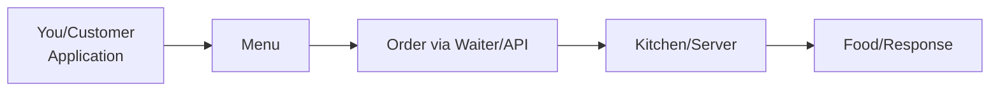
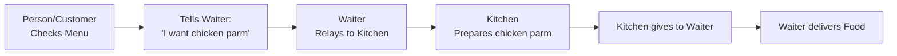
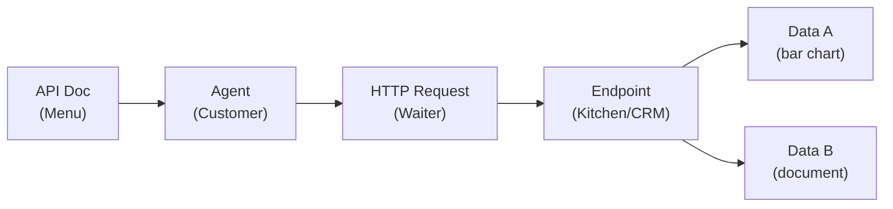

## APIs & HTTP Requests: Powering AI Automation

### The Invisible Bridges Connecting Software

- Scariest thing for beginners (speaker's own experience when starting)
    - APIs and HTTP requests
- High-level overview coming: what they are and how they work
    - Makes setting up first one much easier later
        - In tools like n8n, Zapier, Make, or whatever for sending HTTP requests
- Enables seamless automation

### Overcoming API Intimidation

- Common scary terms when first seeing APIs:
    - API keys
    - Header authentication
    - JSON body
- Speaker's experience: almost cried with JSON, but got over the hump
    - Everyone feels intimidated by API documentation at first

### What Is an API?

- **API** stands for **Application Programming Interface**
- A set of rules that enable two different software applications to communicate
- Think of it as a **digital messenger**

### API Communication Analogy

- Without an API, two software applications can't communicate
    - Like two people who are blind, deaf, and can't feel each other
        - No way to see, hear, or feel → no communication possible
- **API enables communication**
    - Gives applications the ability to 'see, hear, and feel' each other
    - Acts as the essential bridge for interaction

### API Communication Via HTTP Requests

- Without an API, no way for services to communicate
    - Builds on the blind/deaf/isolated analogy: truly no interaction possible
- **HTTP request** as the communication method
    - Like voice, sign language, or physical touch reaching out to the API
    - Enables actual interaction between services
- **One-sentence API definition**: Allows two services to talk to each other
    - Example: n8n talking to Gmail
- Visualization coming to make it clear

### The Restaurant Analogy for APIs

- Rejects basic 'digital messenger' explanation as confusing
- **You = Customer**
    - Application requesting data
- **Waiter = API**
    - Messenger taking your order
- **Kitchen = Server**
    - System processing the request
- **Food = Response**
    - Data delivered back to you

### API Characteristics

- **Standardized Rules**
    - Protocols for software to communicate & exchange data
- **Hidden Complexity**
    - Access functionality without understanding internal workings
- **Digital Connectors**
    - Bridges between different applications & services
    - Like monitors shaking hands, talking (uses JSON)

### Restaurant Analogy - The Menu

- To know what food options the kitchen (server) offers, look at the **menu**
    - Essential first step before ordering
- Just like customers check the menu to understand restaurant capabilities
    - Reveals what data or actions the application can request from the server



### Restaurant Analogy - Ordering Process

- **Check menu first, then order via waiter**
    - Tell waiter: "I looked at the menu, you offer chicken parm, I want chicken parm"
    - Waiter responds: "Okay, cool, let me tell the kitchen"
- **Waiter relays request to kitchen**
    - Kitchen receives order: "Person ordered chicken parm"
    - Kitchen prepares chicken parm
- **Food returned via waiter**
    - Kitchen gives chicken parm back to waiter
    - Waiter delivers to customer



### Restaurant Analogy - Handling Invalid Requests

- **Menu check is essential**
    - Without looking at the menu, you wouldn't know what food to request
    - Might ask for something the kitchen doesn't have
- **What if order unavailable?**
    - Kitchen doesn't prepare it
    - Waiter returns: "Hey, that's not there"
    - Customer: read the menu again and try again

### Restaurant Analogy - AI Agent Example

- **AI agent needs CRM data** (person's name, email, phone number)
    - Must read **API documentation** (the menu) first
    - Tells it what data is available from the CRM (kitchen)
- **Agent crafts HTTP request** (tells the waiter)
    - API doc reveals what to request: e.g., **data A** or **data B**



- Without API docs, agent wouldn't know valid data to request
    - Just like menu prevents ordering unavailable food

### Wrapping Up the High-Level API Understanding

- **Visualization summary**: Restaurant analogy provides the foundational mental model for APIs in AI agents
        - Customer (agent) → Waiter (HTTP request) → Kitchen (endpoint/server) → Food (data response)
        - Always start with menu (API docs) to know what's available
- **This is 'Agent Zero'**: The absolute beginning level
    - Just high-level grasp before technical details
- **Next steps previewed**: Upcoming video covers practical process
        - Reading documentation
        - Using API keys
        - Simple connections (e.g., to services like Gmail, Google Search)
- **Common HTTP responses** (status codes indicating outcomes):

| Code | Meaning |
| --- | --- |
| 200 | Success (OK) |
| 400 | Bad Request |
| 401 | Unauthorized |
| 404 | Not Found |
| 500 | Server Error |

### Everyday APIs in Action

- **Weather Apps**
    - Fetch live forecasts via OpenWeatherMap API
    - Phone sends request to weather server (e.g., type 'LA' for LA weather)
    - Server returns data back to app
- **Social Login**
    - Verify identity without new passwords (e.g., 'Log in with Google')
- **PayPal Payments**
    - Secure transactions processed through APIs
- **Maps Integration**
    - Location services in Uber, DoorDash, etc.
- **PayPal Payments**
    - On Etsy, request goes to PayPal server and response comes back
    - APIs are everywhere — the magic powering services to talk to each other
- **HTTP Requests: The Language of APIs**
    - Composed of key elements:
        - **1. URL/Endpoint**: The destination address (e.g., `https://api.weather.com/current`)
        - **2. Method**: Action type — GET, POST, PUT, DELETE
        - **3. Headers**: Authentication credentials & metadata
        - **4. Body**: Optional data payload being sent

| Element | Description |
| --- | --- |
| 1 URL/Endpoint | Destination address\n\nhttps://api.weather.com/current |
| 2 Method | Action type: GET, POST, PUT, DELETE |
| 3 Headers | Authentication credentials & metadata |
| 4 Body | Optional data payload being sent |

### Endpoint Analogy: Choosing the Restaurant

- **Endpoint** = Which specific restaurant/service to contact
    - Question: "What restaurant do I want?" (e.g., McDonald's)
    - `api.weather.com/current` = The destination service + specific endpoint
- Narrows down the exact spot on the server to send the request

### HTTP Methods: Specifying the Action

- **Method** = Action type to perform on the endpoint
    - GET, POST, PUT, DELETE
        - **POST** most common (used pretty much all the time)
        - **GET** occasional
        - **PUT** and **DELETE** hardly ever used

### Headers: Authentication Like Paying at McDonald's

- **Headers** = Authentication credentials & metadata (e.g., API key or password)
    - Analogy: At McDonald's, when you request fries, you pay with a credit card to get them
        - Without payment (like no API key), no fries (no access)
    - Enables the server to verify and grant access to the requested data/service

### Body: Customizing the Request

- **Body** = Optional data payload with extra details
    - Analogy: At McDonald's, specifying "extra crispy, no salt, gluten-free" for fries
    - Sends additional instructions beyond the basic order

### The Request-Response Cycle

- **Send Request**: App contacts API endpoint
- **Process**: Server retrieves or modifies data
- **Return Response**: Status code + requested data
- **Display Result**: App uses the information
- Entire cycle happens in **milliseconds**

| Step | Description |
| --- | --- |
| Send Request | App contacts API endpoint |
| Process | Server retrieves/modifies data |
| Return Response | Status code + requested data |
| Display Result | App uses the information |

### Understanding JSON Responses

- **Human-Readable Data Format** returned from the server
    - **JSON** = JavaScript Object Notation
    - Organized like labeled folders with **key-value pairs**

```json
{
  "location": "Chicago",
  "temperature": 72,
  "conditions": "sunny",
  "humidity": 45
}
```

- **Weather App Example**: Type in Chicago → server returns JSON with location, temp (72), conditions (sunny), humidity (45)
    - Matches earlier JSON lesson; APIs deliver data this way for apps to parse and display

### API Authentication

- **Purposes**:
    - **Security**: Prevent unauthorized access
    - **Access Control**: Define permission levels
    - **Usage Tracking**: Monitor request volumes
    - **Billing**: Charge based on usage
- **API Keys** = unique passwords proving your application has permission
    - Obtained from server setup
    - Unique to you (never share publicly, e.g., delete from YouTube demos)
    - Used in headers for authentication (ties back to McDonald's payment analogy)
- **Don't share API keys publicly** (like passwords)
    - Could drain accounts/money if billing-enabled service
    - Unique to you; treat as sensitive billing access

### Why APIs Power AI Automation

- **Connect Systems**: Link AI to CRMs, databases, email platforms (or systems to systems)
- **Real-Time Data**: Access live, current information instantly
    - Without it, automation would be "horrible"
- **Event Triggers**: Webhooks notify when actions occur
- **Scalability**: Leverage existing proven services
- **Standards**: Consistent, documented interactions

| Benefit | Description |
| --- | --- |
| Connect Systems | Link AI to CRMs, databases, email platforms |
| Real-Time Data | Access live, current information instantly |
| Event Triggers | Webhooks notify when actions occur |
| Scalability | Leverage existing proven services |
| Standards | Consistent, documented interactions |

### Event Triggers in Action - Webhook Example

- **Automatic Triggers via Webhooks**: Events like form submissions trigger API requests instantly
    - **Real Example** (old Uppit AI website):
    - User fills 'Get Started' form: Name, Email, Project Details
    - **Submit** button sends HTTP request to **n8n workflow**
    - n8n captures data, stores in database, sends email notification
    - Enables seamless automation without manual intervention
- Ties back to **Why APIs Power AI Automation** → real-time, event-driven connections between systems

### APIs: Bottom Line Benefits

- **Core Role**: Connective tissue enabling systems to communicate, share data, and trigger actions *reliably*
- **Abstraction = Power**: Focus on automation logic (not low-level complexity) → build faster, scale further
- **Practical Impact**: Connect AI to dozens of services without custom integrations
- **Transformation**: Turns 'impossible' challenges into manageable, documented connections
- **Key Advantage**: Consistent standards let chat models (and anyone) easily set up automations → unlimited abilities in n8n, Make, Python, etc.

### API Lesson Takeaway

- **Goal Achieved**: Understand the pieces (endpoints, methods, headers, body, JSON responses, API keys) and how APIs/HTTP requests work at a high level
    - No need to yet "go to a website, read API documentation, and set up an end-to-end request"
- **Outcome**: Foundation for building scalable systems that work
    - Enables next steps: practical implementation in tools like n8n, Make, Python
- **Reassurance**: Even without hands-on setup yet, this conceptual grasp transforms APIs from scary to approachable