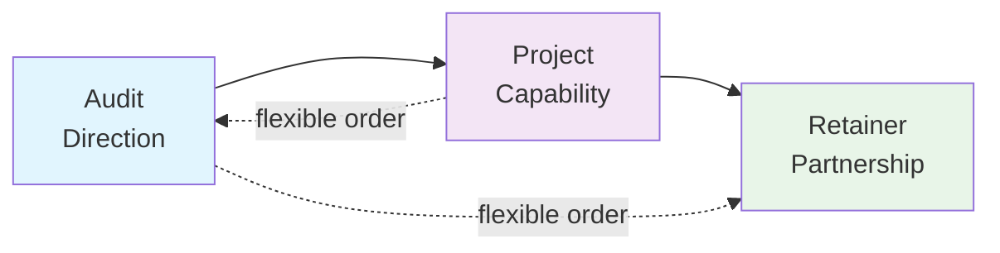

## How to Earn Consistent Income and Stop Chasing Clients

### Why Most AI Agencies Stay Broke

#### Revenue Resets to Zero

- One-off projects mean revenue drops to $0 every month after delivery and payment
    - Cycle repeats: find new clients just to maintain income
    - Creates same pressure each month with fluctuating incomes resetting to $0

#### The Delivery Trap

- Delivery work consumes 85% of schedule
    - Building systems
    - Fixing issues
    - Responding to client requests
- What gets pushed aside (key activities neglected)

#### What Gets Pushed Aside

- Key growth activities neglected due to delivery overload:
    - Marketing
    - Sales
    - Internal systems improvement

#### Why Technically Strong Operators Under-Earn

- Price work as tasks instead of solving larger problems
- Each engagement treated as separate deal
- Random pricing: tasks, separate deals, no consistency

#### Consistent Model Benefits

- Structure → Predictability
    - Clients understand how to work with you
    - Plan your time and income
    - Direction for the business

**Without structure, effort doesn't compound**

### How Clients Enter the Model

- The **partner model** introduces structure to client relationships
    - Builds on the service ladder as a framework
- Key question: How does someone trust you enough to move toward long-term partnership?
    - Depends on **one thing**: Where the relationship starts

#### Relationship Starting Points

- **Warm**: Referral or existing relationship
- **Cold**: Upwork, cold outreach

#### Cold Relationships

- Looking for a **specific outcome** (already have something in mind)
    - Examples: workflow automated, chatbot, system connected
- **Not looking for advice yet**

#### Cold Relationships Path

- Cold leads want execution on a **specific outcome** (not advice yet)
    - Start with a **project** to prove you can deliver
- Once trust exists:
        - Conversation expands
        - Step back to broader system
        - **Audit** identifies other opportunities
- As improvements stack:
        - **Retainer** becomes natural next step
- **Cold Path**: Project → Audit → Retainer

🔥 Warm Relationships (up next)

#### Warm Relationships

- **Warm**: Already know you or came through referral
    - Pre-existing trust/familiarity
    - More open to your perspective
    - Ask: "What should we actually do? What can AI help me with?"

#### Warm Path

- **1. Audit**: Diagnose the business, identify opportunities
- **2. Project**: Implement solutions
- **3. Retainer**: Ongoing partnership

#### Retainer Benefits

- **Stability benefits both sides**
    - Creates **stable monthly revenue**
    - For you: Removes constant pressure to hunt for new clients

**Retainers are the most important stage**

### Retainer Benefits (cont.)

- **Benefits both sides**
    - For you: Removes constant pressure to hunt new clients just to keep income steady
    - For client: Ongoing access to someone who understands their systems
        - Compensated for continuous improvement, not just one-off builds

### Common Mistakes

- **Treating audits as unnecessary extra work**
    - **Reality**: Shifts role from **builder** (wrench icon) → **advisor** (brain icon)
        - Diagnose first to **prevent solving the wrong problem**
        - **Establishes authority** early in the relationship

### Common Mistakes (cont.)

- **Treating projects as the end goal**
    - Projects prove you can deliver results
    - But stopping there = **constant client hunting**
    - Projects aren't the entire business model

### Retainer Timing

- **Too Early**: Premature, trust not built yet
- **Just Right**: Feels like **natural next step**
- **Too Late**: Client tries to solve next problem internally
- **Timing > Persuasion**
    - When earlier stages (audit/project) executed well → retainer flows naturally

### Action Step

- Take a minute to organize the structure

### Stage Details: Problems Solved & Timing

- **Audit**
    - **Problem solved**: Diagnoses business issues and identifies AI opportunities
    - **Typical timing**: Initial stage to establish direction
- **Project**
    - **Problem solved**: Implements specific solutions to prove capability
    - **Typical timing**: Follows audit, after opportunities are identified
- **Retainer**
    - **Problem solved**: Provides ongoing partnership for continuous improvement
    - **Typical timing**: After successful project, when trust is built

### Action Step Details

- **For each stage, write down**:
    - 1. What problem it solves
    - 2. When it typically shows up in a client relationship
- Don't yet worry about pricing

### Lesson Wrap-Up

- **Primary goal**: Grasp the structure of the AI partner model
    - Audit, project, retainer stages
    - Future lessons build directly on this foundation
- That's it for this lesson