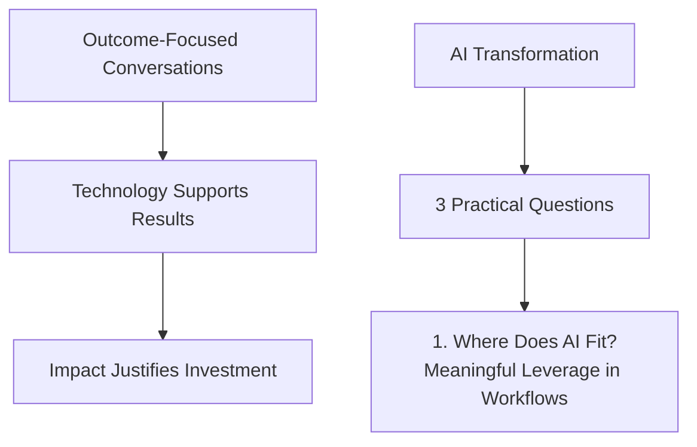
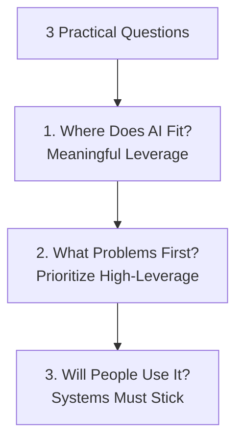
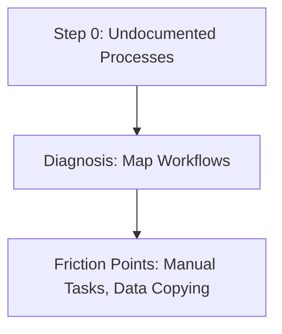
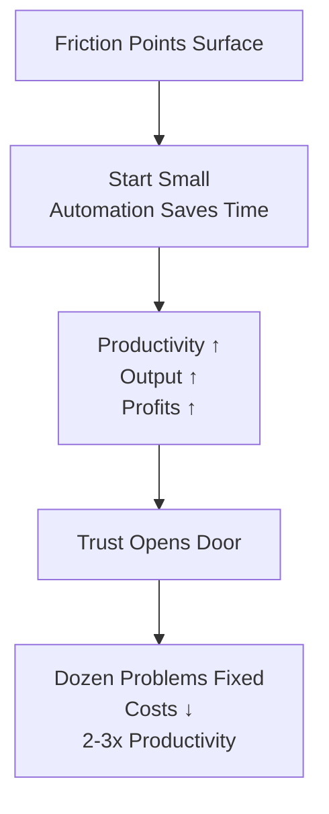
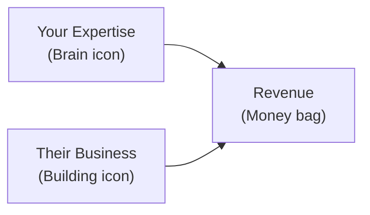
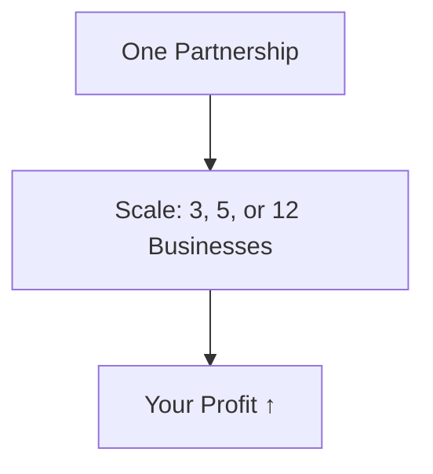
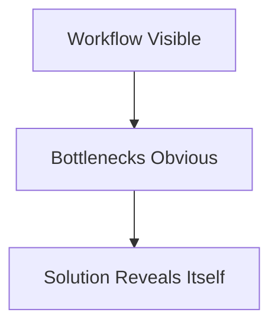

## The AI Opportunity

- Common assumption: AI is about building automation or agents
    - Sounds reasonable and technically true in most cases
- **That's not where the money is**
    - Businesses know they need AI but worry about:
        - Choosing the wrong tools
        - Spending money on nothing
        - AI initiative failing internally
- Additional pressure: Decision makers feel they're already behind
    - Constant discussions amplify this feeling

## Becoming a Strategic Guide

- Decision makers feel behind due to:
    - Competitors experimenting with AI
    - Internal teams playing with new tools
    - No clear answer on where AI fits in the business
    - No one telling them how to win
- They want **guidance from a strategic partner**, not just someone building automations
- Key strategic questions (not technical):
    - How can AI help us grow faster?
    - What should we focus on first?
    - Where is the real ROI?
    - Where are we just wasting our time?

### From Builder to Guide

- Shift role: Position as **AI Partner** modernizing businesses, not just tool builder
    - **[Tool Builder] -> [AI Partner]** (arrow diagram on screen)
- **Process starts with** understanding current business operations
    - Make workflows visible → patterns emerge
- **Operational Bottlenecks** (key patterns where AI creates leverage):
    - ⏰ Large amounts of time consumed
    - 🔄 Work duplicated across departments
    - 🐌 Information moves slowly between systems or teams
- **Role**: Help companies recognize these opportunities
    - Avoid chasing tools that don't fit

### Implementation and Value Beyond Execution

- **Once opportunity clear → implementation follows**
    - Introduce systems that:
        - Reduce manual effort
        - Remove friction
        - Improve work flow through organization
- **Value sources**: Execution + Judgment
    - Execution: Part of the job (introducing systems)
    - Judgment: Major role (e.g., choosing right opportunities)
- **Business owners care about outcomes, not tech details**
    - Specific model/platform/tool rarely matters
    - Key outcomes:
        - ✅ Team gets time back
        - ✅ Operational costs decrease
        - ✅ Bottlenecks disappear

### Impact of Outcome-Focused Conversations

- When conversations center around outcomes, the dynamic changes
    - Technology becomes a tool supporting results, not the product sold
- Businesses justify investment more easily when focus shifts to impact
    - Common theme repeated throughout the course

### What AI Transformation Actually Means

- Sounds complicated but straightforward in practice
- Helping business answer **3 practical questions**
    - Every AI transformation starts here

#### 1. Where Does AI Fit?

- Not every process needs automation
- Identify where **meaningful leverage** exists inside workflows
    - Builds directly on spotting operational bottlenecks

#### 2. What Problems Should Be Solved First?

- Companies have dozens of potential AI improvements
    - Some produce only **minor benefits**
    - Others **unlock much larger gains**
- **Prioritization is key** to focus on high-leverage opportunities

#### 3. Will People Actually Use It?

- Technology only produces value **if people use it**
- Systems disconnected from day-to-day work **rarely stick**
    - Focus on implementation that integrates seamlessly

### Guiding Through the 3 Stages and Ongoing Partnership

- **AI transformation partner guides through all three stages**:
    - Understand existing processes
    - Identify opportunities for improvement
    - Implement solutions that align with company's real objectives
- **Relationship continues post-implementation**:
    - Businesses evolve, new opportunities appear, processes change over time
    - Partner's understanding of operations makes improving existing systems easier
- **Why this role matters**: Most companies still at **step zero** with AI
    - Highlights need for strategic guidance from the start

### Step 0 - Diagnosis Phase

- **Starting reality**: Processes not documented, workflows exist as informal knowledge
    - Everyone feels busy, but unclear where time is lost
- **Diagnosis Before Solutions**
    - Effective partners understand how the business works first
        - Speak with people across different departments
        - Map how work moves step to step inside a process
- **Friction Points Surface**
    - Tasks far more manual than expected
    - Information copied between systems repeatedly

### Start Small After Diagnosis

- **Friction leads to action**: Hours spent weekly on low-value work (e.g., manual tasks, data copying)
    - **Start small**: Create one automation that saves everyone time
        - Employees more productive
        - Output increases
        - Profits rise
    - **That's just the beginning**

### Building Trust Through Wins

- **Diagnosis uncovers more**: Dozen problems costing real money + dozen ways to improve product/service vs. competitors
- **Small win builds trust** → move forward with larger changes
    - Month by month: Reduce costs
    - Employees 2-3x more productive
    - Eliminate work no one wants

### Partnership Drives Revenue

- **Partnership creates revenue**: Not from automation or AI agents alone, but from combining **your expertise** + **their business**
    - They get rich, and so do you (request a small piece of profits)
    - True partnership in every sense

### Scale with Multiple Partnerships

- **Exciting scale potential**: Partner with more than one business
    - Receive cut of profits from **3, 5, or 12** different businesses
- **Core insight**: Not about the tools
    - About knowing how to use AI to **create profit**

### Advantages of Deep Operational Understanding

- **Core principle**: It's not about the tools—it's about knowing how to use AI to create profit
- **Visibility unlocks solutions**:
    - Workflow becomes visible → bottlenecks become obvious
    - Once problem is clear, solution tends to reveal itself

- **Competitive edge over vendors**:
    - Process gives deep understanding of business operations
    - Future improvements build on existing knowledge
    - Avoid starting from scratch each time
- **Client perspective**: Prefer continuing with partner who already understands their operations

### Diagnosis Payoff and Ongoing Advantage

- **Key benefits of mapping workflows**:
    - Workflow becomes visible
    - Bottlenecks become obvious
    - Solution reveals itself
- **Ongoing edge**: Partner's operational knowledge makes improvements far easier than onboarding someone new every time a new project appears