## AI's Unique Opportunity

- AI is going to change everything
    - Part of you believes it from headlines, improving tools, and businesses paying attention
- Doubt: Is this a real opportunity for me, or just another tech wave benefiting those already ahead?
    - Fair question—most tech shifts leave regular people behind
        - Gains go to **Insiders**, **Early Investors**, or people with **Existing Connections**
- **Key difference**: This one is different

## Biggest Wealth Creation Window

- Next **5-10 years** = single biggest wealth creation opportunity most will ever see
    - People who **move now** benefit most

## The Industrial Revolution - What Actually Happened

- School version: Factories & steam engines
- Reality: Last time world got **flipped on its head**

### Life Before 1750

- Most people = **farmers** in countryside
    - Some hand spinning/weaving
- Everything **slow & expensive**

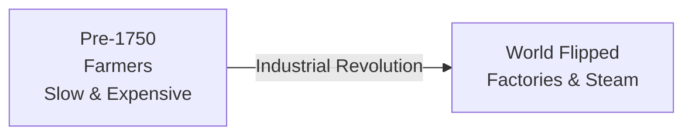

### Life Before 1750 (Detailed)

- Everything relied on **people or animals**
    - Place in society **pretty much fixed**
    - Getting rich took **generations**
    - All about **owning land**

### Fast Forward to 1850

- Everything **buzzing**—people rushed to **cities** for **massive factories**
    - **Steam power** + **new machines** churned out products **super fast**
    - Made things **cheaper** and **way more accessible**
- Created **new class of seriously wealthy industrialists**
    - **New fortunes** from industry
    - But also **tough factory jobs** and **city poverty**

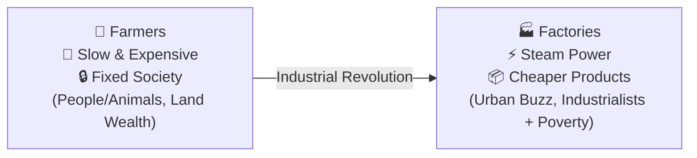

### Industrial Revolution Outcomes & Speed Contrast

- Despite downsides, created **insane explosion in technology** + **birthed modern middle class**
    - Entire new social class emerged
- **Speed is the difference**
    - Industrial Revolution: \~**100 years** to play out
        - People had **decades** to figure it out, reposition, catch up
    - AI: **No time**—happening **very fast**

### AI Restructuring Knowledge Work

- AI hitting **all knowledge work**
    - Customer support, content creation, data analysis, sales outreach, reporting
- **Team of 5 → 1 person** in **1-2 years**
    - Tasks shrinking dramatically

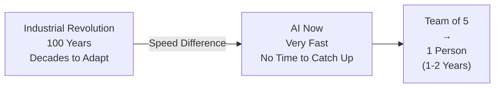

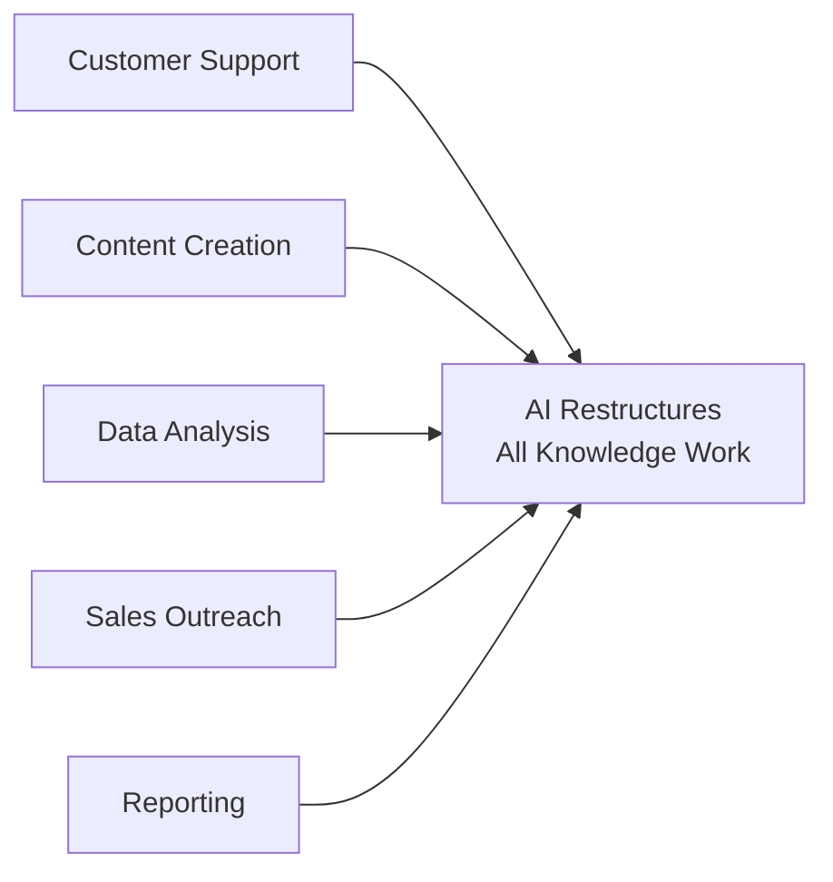

### AI vs Industrial Revolution: Speed Difference

- **Team of Five → One Person**: AI already enabling massive productivity jumps in companies implementing it seriously
- **The Difference Is Speed**
    - Industrial Revolution: **Century** to reshape economy
    - AI: Doing it in **years**
    - Tools improve **month to month** (not generation to generation)
    - Impossible in January → standard by June

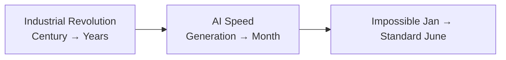

### The Compression Changes Everything

- **Greater payoff per year** than anything before
    - Massive potential rewards compressed into short time
- **Shorter window**: Early advantage (being first to do this work) **won't last forever**
    - Move now to capture it

### Businesses Currently Stuck on AI Adoption

- **Field wide open right now**—but **5 years from now**, definitely will not be
    - **Move now** to capture early advantage before it closes
- **Inside most businesses**: Feeling **behind**—**numbers confirm it**
    - Know they **need AI**
    - **Competitors experimenting**
    - **Employees playing with ChatGPT**
    - **Board asking questions**

### The Adoption Gap

| Metric | Percentage |
| --- | --- |
| Adopting AI | 78% |
| Actually Deployed (meaningful) | 27% |

- **3 out of 4 businesses are stuck**
    - Started path but **dipped toes in** only—no real deployment

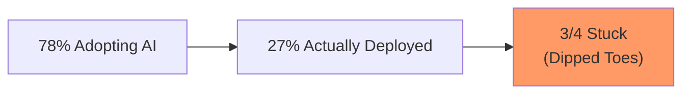

### AI Implementation Roadblock & Massive Market Demand

- Businesses that started AI **haven't figured out how to make it actually work**
    - **Demand for help is enormous**

### AI Automation Market Explosion

- Hit **$130 billion** in **2025**
- Projected to **pass $1 trillion by 2033**
    - **Not a niche**—**entire economy being rebuilt**

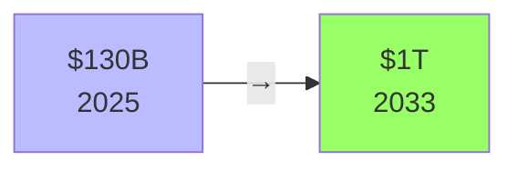

### Critical Talent Shortage

- **AI Talent Demand Exceeds Supply by 3.2 to 1**
    - For every qualified person, **>3 businesses need them**

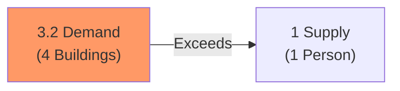

- **Manpower Group's 2026 survey**: **AI skills** = **single hardest thing for employers to find**

| Metric | Detail |
| --- | --- |
| AI Automation Market | $130B (2025) → $1T (2033) |
| Talent Ratio | Demand 3.2 : 1 Supply |
| Hardest Skill | AI Skills |

### AI Skills - Hardest to Find

- **AI skills** = **hardest for employers** (per Manpower Group 2026 survey)
    - Harder than **engineering**, **IT**, or any other capability

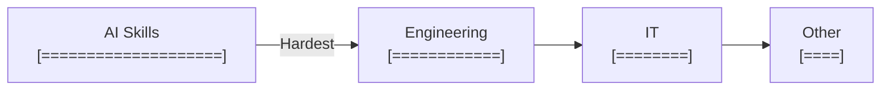

### Skills Gap Economic Cost

- IDC estimate: **$5.5T** lost globally
    - From **delayed projects**, **missed revenue**, **lost competitiveness**

### What Businesses Actually Need

- Not builders of ML models
- People who **walk into a business** and:
    - **Find problems** ("here's where you're losing money")
    - **Show where AI makes money** ("here's where AI fixes that")

### Current Supply Mismatch

- **Almost no one** doing this high-value work
    - **Plenty** of developers
    - **Plenty** of prompt engineers

| Demand Type | Availability |
| --- | --- |
| Business AI Consultants | Almost None |
| Developers | Plenty |
| Prompt Engineers | Plenty |

### The Real AI Opportunity - Business Problem Solvers

- **Almost no one** can connect AI to **real business problems**
    - Plenty of developers & prompt engineers
    - **Few** sit with owners, understand operations, identify **profit spots**

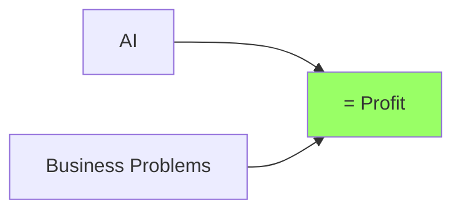

- **That gap** = **where the money is**

### Businesses Pay for Problem Solvers

- Pay **well** for someone figuring out **problems they don't understand**
    - Not shopping for **cheapest chatbot builder**
    - Want **problem solver**

### First Movers Win Big

- Capture **before market crowds**
    - **Relationships**
    - **Reputation**
    - **Recurring revenue**

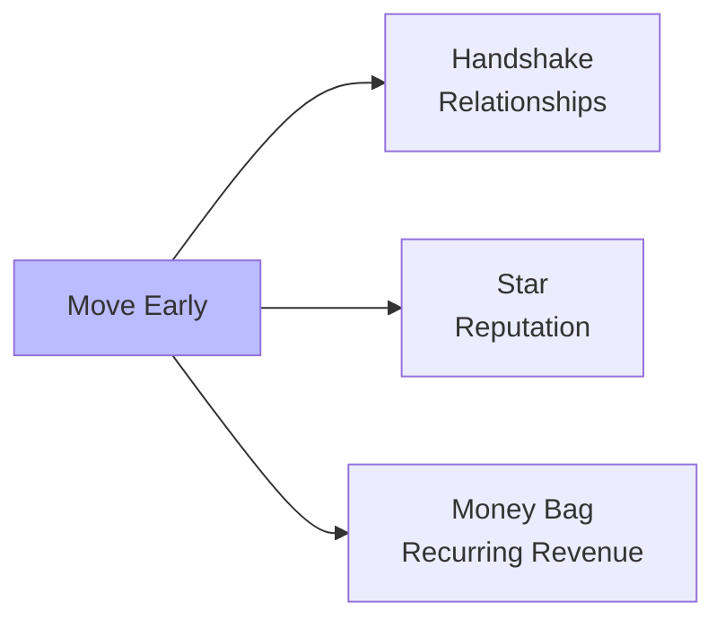

### Proven Revenue Model - No Massive Agency Needed

- **This isn't theoretical**—**hundreds** already making **six figures+** yearly
    - From **my community**
- **Simple client math**:
    - **$20K/month** × **4 clients** = **$1M/year**
    - Starting engagements: **$2.5K–$5K/month** per client
        - **Reasonable** when **solving real problems**

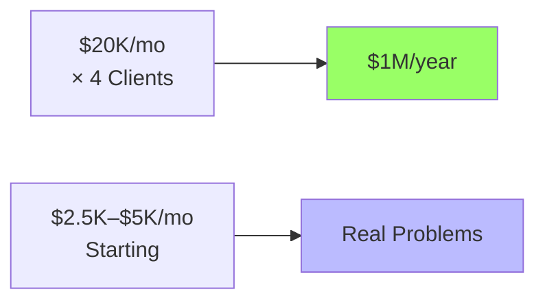

### Value Creation Model - Both Sides Win

- Focus on **operational problems**: Reduce costs or increase revenue (not toy projects)
    - **Creates new profit** that didn't exist before
    - Consultant keeps **percentage** of generated value
- **Example**: Save company **$15K/month** → charge **$3K** = **easy yes**
    - Business grows + consultant grows together

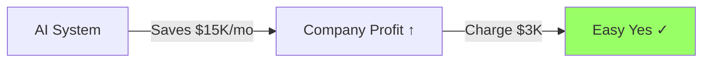

### 90-Day Vision

- **First 2 clients on retainer**
    - Pay **monthly**
    - Because systems **save real money** + **drive growth**

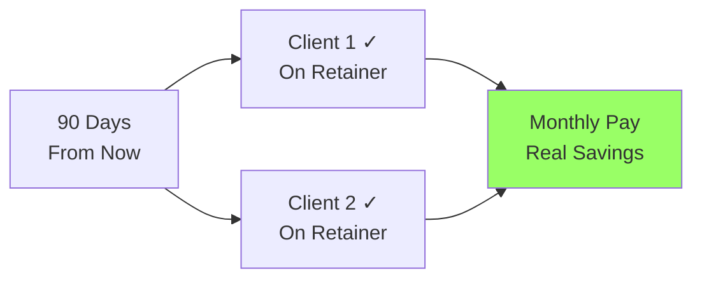

### The AI Consultant Success Path

- **No computer science degree needed**
    - Learn where **AI creates profit**
    - Walk into businesses that need help
    - **Deliver results**
- **Outcome**: Income growing + clients refer you to other owners
    - Become one shaping how companies work in **AI era**
- That future = **only 90 days away**
    - This course shows how to get there

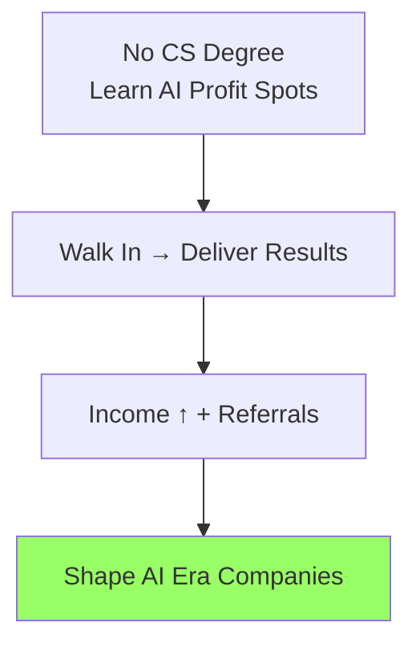