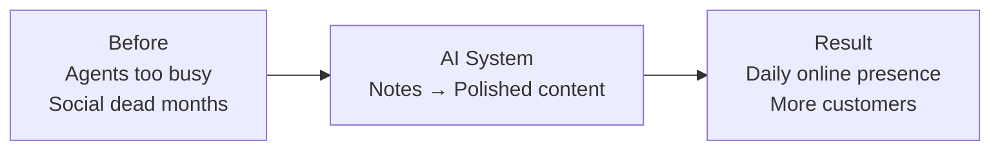
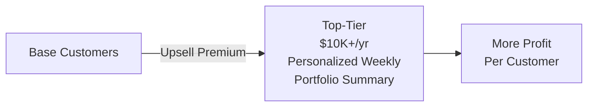
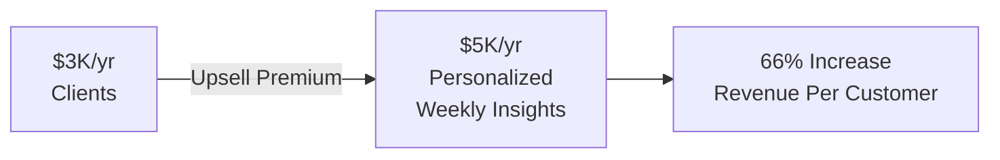
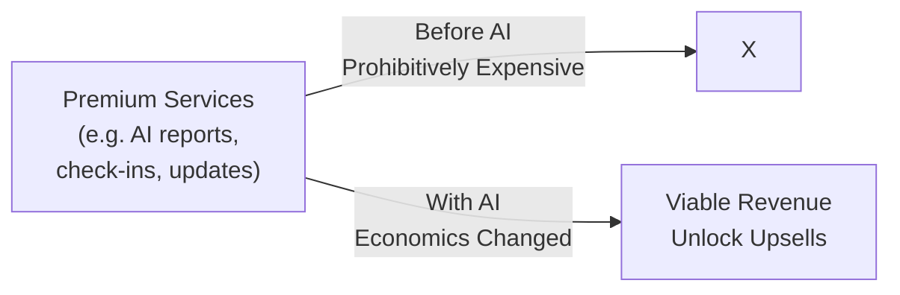
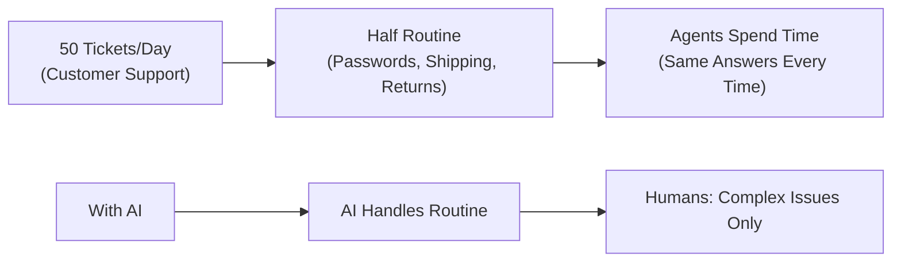
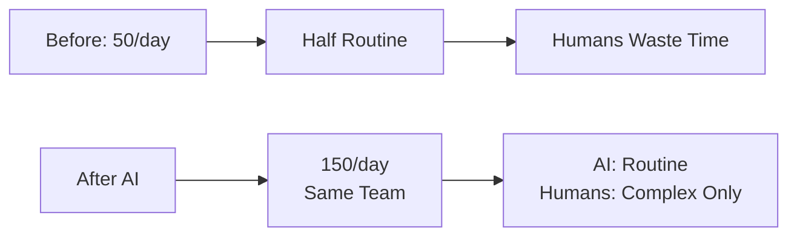
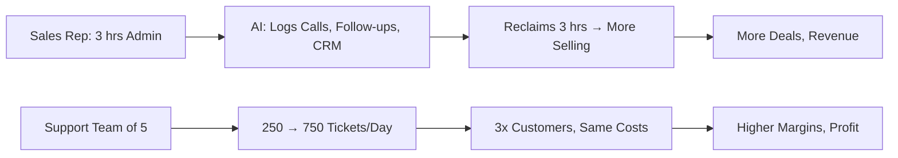
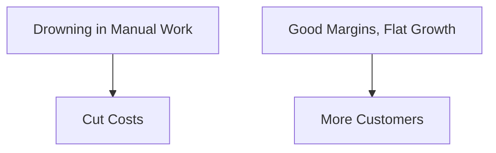
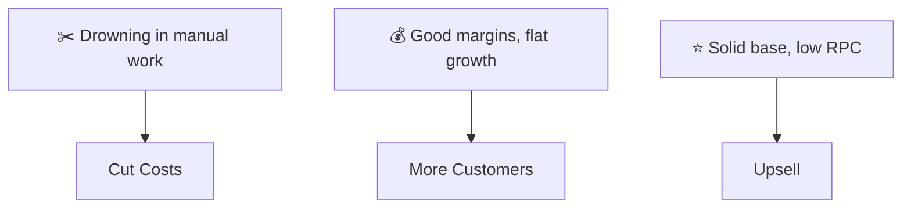
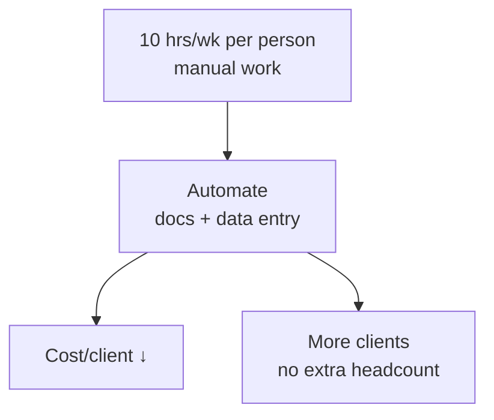

## The Three Ways AI Creates Profit

- Businesses don't care about AI agents or automations
    - They care about **profit**—specifically, **increasing their profit**
    - AI is just a **means to that end**

### Creating Profit Requires Two Things

- **How AI works** + **How businesses work**
    - AI side covered later
    - This lesson: **business side**
- **Truth**: Without understanding profit sources
    - Tech skills don't matter—you'll just be **guessing**
    - Business owners **can smell a guess** from across the room
- **Goal**: Simple framework by lesson's end
    - \`\`\`mermaid

  flowchart LR

    A["How AI Works (robot icon)"] -->|+| B["How Business Works (building icon)"]

    A --> C[Profit]

    B --> C

  \`\`\`

### Profit Only Comes from Three Places

- **Simple Framework**: 3 parts that work for **any business, any industry, any size**
    - Identifies exactly where AI makes a financial difference
- **Every business looks different on the outside**
    - Different industries, products, team sizes
    - Examples: Law Firm ≠ E-Commerce Brand
    - Landscaping Company ≠ SaaS Startup
- **But profit works the same everywhere**
    - **Only three ways to increase profit**:

        1. Get more customers
        2. Make each customer worth more
        3. Cut costs

- **No fourth option**—**cut costs** completes the three; has never been otherwise
    - **Every profitable initiative** fits one:
            - **New marketing campaign** → **more customers** (megaphone icon)
            - **Premium tier or upsell** → **worth more** (star icon)
            - **Streamlining operations** → **cut costs** (gear icon)
- **Relief**: Don't need every industry detail
        - Just map initiatives to these **three categories**

### Applying the Three Profit Levers

- **Process**: Don't master every industry detail
    - Just identify which of the three areas (**get more customers**, **make each worth more**, **cut costs**) has **the most room to improve**
    - Then **figure out how AI can improve it**
    - **That's the whole game**

### Content Creation for More Customers

- Every business owner knows they **should create content**
    - **Blog Posts**
    - **Social Media**
    - **Newsletters**
    - **Videos**
    - Advice is **everywhere**; most **agree** with it
- **Problem**: Content **takes a lot of time** to produce
- **Result**: The **Guilty Cycle**
    - Post for a **few weeks**
    - Things **get busy**
    - They **stop**

### Example: Breaking the Content Posting Cycle with AI

- **The Guilty Cycle** (typical without AI):
    - Post consistently for a few weeks
    - Things get busy → stop posting
    - Feel guilty → promise to restart Monday
    - Three months pass → repeats
- **AI Breaks That Cycle** (fits **make each customer worth more**):
    - Draft blog posts from bullet points
    - Turn one long-form piece into a week's social posts
    - Generate email sequences, newsletters, content calendars
    - All in a **fraction of manual time**
- **Real Estate Agency Example**:
    - **Before**: Agents (human) too busy showing houses/closing deals → social media dead for months
    - **Know they should post**: Market updates, client success stories
    - **AI enables**: Consistent posting without extra time

### Real Estate Agency Example: Get More Customers

- **Before**: Agents too busy to post; social media dead for months
- **AI System**: Drop in a few notes → AI turns into polished content (posts, emails, blog entries)
- **Result**: Showing up online every day → more people see them → more inquiries → **more customers**
- **Next Example Setup**: Prospecting & Outreach (esp. B2B)
    - Problem: Preparation takes too long
    - Find the right person
    - Research their company
    - Figure out what to say

- **Prospecting & Outreach** (under **Get More Customers**)
    - **Problem**: Preparation takes **2-3 hours a day**
        - Find the right person
        - Research their company
        - Write a **personalized message** (not generic pitch)
    - **Result**: Only a **handful of messages** sent
    - **AI Solution**: Handles most preparation
        - Identify companies fitting a specific profile
        - Pull relevant information
        - Draft personalized outreach referencing **real details** about prospect's business
    - **Salesperson role**: Still reviews and sends
    - **Impact**: Prep drops from **hours to minutes**
        - Example: From **20 outreach messages per week** to dramatically more
- **Outreach Impact**: From **20 messages/week** to **200** (personalized → response rate **doesn't drop, goes up**)
    - **Result**: More customers

### Advertising Production Bottlenecks & AI Fix

- **Core Problem**: Paid ads limited by **production speed**
    - **Bottleneck 1**: Writing ad copy
    - **Bottleneck 2**: Designing images, graphics, video
    - **Typical Result**: Same **3-4 ads** run for **months** (no time for new ones)
- **AI Speeds Up Both Sides**
    - **Copy Side**: Generate **dozens of ad variations** in **minutes**
        - Different **hooks**
        - Different **CTAs**
        - Different **angles**
- **Creative Side**: AI image and video tools produce visuals in **minutes** (used to require designer + **hours**)
    - Example: **10 product image variations** with different backgrounds/text overlays
        - **Before**: Half-day project
        - **Now**: Minutes
- **Ad Variations Per Month**: From **3** to **30**
    - **Find what works faster**
    - **Waste less money** on losers
    - **Scale winners** more quickly
- **Result**: More customers (businesses already want rapid testing)

### Make Each Customer Worth More (Second Profit Lever)

- **Why it's easy**: Getting existing customers to spend more grows profit quickly
    - Trust already established
    - Relationship in place
    - Customer knows the product
- **Untapped potential**: Most businesses have **significant room** here
- **Core barrier**: Economics don't work—**premium services cost too much to deliver**
- **Financial Advisory Firm Example**
    - **Top-Tier Clients**: **$10K+/yr**
        - Get **personalized weekly portfolio summary** with insights and recommendations

- **Current Limitation**: Personalized weekly portfolio summaries take **junior analyst a few hours** each
    - Only offered to **top-tier clients** ($**10K+/yr**)
    - **Everyone else** ($**2-3K/yr**) gets **nothing beyond basics**
- **AI Solution**: System generates weekly summaries automatically
    - **Pulls portfolio data**
    - **Identifies relevant market trends**
    - **Drafts personalized report per client**
    - **Human reviews and approves** (heavy lifting done)
- **Time Savings**: **Hours of analyst time** → **minutes of review time**
    - Enables offering premium service to **hundreds of lower-tier clients**
    - **Result**: Each customer worth more (upsell potential unlocked)
- **New Capability**: Offer premium service to **every client** and **charge for it**
        - **Before**: $**3K/yr**
        - **After**: $**5K/yr** for personalized weekly insights
        - **66% revenue increase per customer** — no new clients needed

- **Universal Pattern Across Industries**
        - **Marketing Agency**: AI-generated performance reports with strategic insights for **every client** (not just big accounts)
        - **Coaching Business**: Daily AI-powered check-ins between sessions
        - **HR Consulting Firm**: Ongoing policy monitoring and compliance updates
    - **Key Insight**: AI automates delivery of premium services previously too costly, unlocking upsell potential everywhere
- **Key Partner Question**: "What would your customers love to have that you currently can't offer?"
    - Opens up revenue opportunities previously uneconomical
    - AI changes the economics — makes premium services viable
- **Universal Insight**: Premium services (like those examples) were **prohibitively expensive before AI** — but now they're not

### Cut the Cost of Delivery

- **Third Profit Lever**: AI automation
    - Most people think of this first when hearing "AI"
    - AI **can absolutely reduce** costs

- **Framing Matters** for cost-cutting discussions
    - **Don't say**: Eliminate people [Red X]
    - **Do say**: Eliminate **drudgery** [Green check]
        - Talking headcount reduction → **everyone becomes your enemy** (even owner likes their team, doesn't want to fire anyone)
- **Common Drudgery Tasks** (repetitive, manual, mind-numbing)
    - Data entry
    - Copying information between systems
    - Formatting reports
    - Sorting through inboxes
    - Chasing people down for documents
    - **Impact**: Eat up **hours every week** — sometimes **dozens of hours**
    - **AI can take most of these** (implied next)
- **AI Solutions for Drudgery** (builds directly on the common tasks)
    - **Automated data extraction**
    - **Automated report generation**
    - **Automated document collection**
    - **Automated inbox sorting**
    - Work still gets done — **no human required anymore**
- **Core Benefit**: Frees people for the work they were **hired for**
    - Remove manual work → people do what **actually matters**
- **Customer Support Example**
    - **Before**: 50 tickets/day
        - **Half routine** (password resets, shipping status, return policies)
        - Agents spend time despite **same answers every time**
    - **With AI**: AI handles routine tickets
        - Humans **only** deal with complex issues
        - **Saves massive time** on repetitive half

---

- **Customer Support Scaling Example** (builds on routine tickets)
    - **Before**: 50 tickets/day
        - Half routine (password resets, shipping status, return policies)
    - **After AI**: Same team handles **150 tickets/day**
        - AI takes routine → humans **only complex issues**
        - Not harder work, just **no wasted time** on rote tasks

- **Sales Team Admin Bottleneck**
    - Each rep: **3 hours/day** on manual admin
        - Updating CRM
        - Writing follow-up emails
        - Prepping meeting notes
        - Logging call summaries
    - **Impact**: **3 hours/day** **not talking to prospects**
    - **AI Fix**: Automates admin → **Manual Admin → AI Automated**
        - Reclaims time for **revenue-generating calls**
- **Sales Team Admin Automation Results**
    - **AI Fix**: Logs calls, drops follow-ups, updates CRM
    - **Reclaims**: 3 hours/day per rep → **more conversations, more deals, more revenue**
    - No additional salespeople needed
- **Cost Scaling Math**
    - Support team of 5: **250 tickets/day → 750/day** (3x volume)
    - Serves **3x customer base** at **same labor costs**
    - **Savings**: Straight to bottom line → **margins improve, profit increases**
    - Enables **more clients without adding headcount**

- **How AI Pays for Itself**
    - **Not** by replacing people
    - **Yes**: Making existing people **far more effective**

### How to Think Like a Partner

- You have the **three-lever framework**
    - But not every business needs all three at once
- **Your value**: Prioritization
    - Figure out **biggest opportunity** → start there
- **Where to Start**
    - **Drowning in manual work** → **Cut Costs** (quick win, builds trust, immediate relief)
    - **Good margins, flat growth** → **More Customers**

- **Where to Start (cont.)**
    - **Solid customer base, low revenue per customer** → **Upsell opportunities**
        - Find the **premium service** that **AI makes possible**

- **Walk into a Meeting with This Framework**
    - **Not**: Talking about chatbots, pitching automations
    - **Yes**: Talking about **where the profit is** and **how to go get it**
    - **Difference**: **Project** vs **Partnership**
- **Putting It All Together**
    - **Mid-Sized Accounting Firm Example**
        - **200 clients**
        - **Team of 12**
- **Mid-Sized Accounting Firm (200 clients, 12 team)**
    - **Cut Costs**: 10 hrs/week per person on manual work
    - Chasing clients for documents, data entry, formatting reports
    - Total: **120 hrs/week = 3 full-time salaries**
    - Spent on work **no accounting expertise needed**
    - **More Customers**: Want newsletter + LinkedIn posts
    - Partners discuss quarterly, but **nobody has time**
    - **Competitor**: Posts **every single day**
- **Worth More (Third Lever)**
    - **$15K/yr clients**: Get quarterly strategy reviews
    - Tax planning, cashflow projections, financial insights
    - Clients **love** these documents
    - **$3-5K/yr clients**: Get **nothing** beyond basic tax prep
    - Can't afford to offer premium service to everyone
- **Three Levers Right in Front of You**
    - **1. Cut Costs**
    - Automate document collection + data entry
    - Cost per client **goes down**
    - Team handles **more clients** without adding headcount

- **Three Levers Right in Front of You (cont.)**
    - **2. More Customers**
        - AI-assisted content system
        - Weekly LinkedIn posts + monthly newsletter
        - More visibility, more inbound leads
    - **3. Worth More**
        - Personalized financial insights for **every client**, every month
        - Premium add-on: **+$1,500/year**
        - Revenue per customer **goes up**
- **You Don't Need to Be an Accountant**
    - Understand **where profit comes from**
    - See **opportunities the owner is too busy to notice**
- **That's the Job**
    - Understand where profit comes from
    - See opportunities the owner is too busy to notice
- **Transition to Next**
    - You now have the framework
    - Next: How to find and land a business
    - Focus on finding and landing partnerships