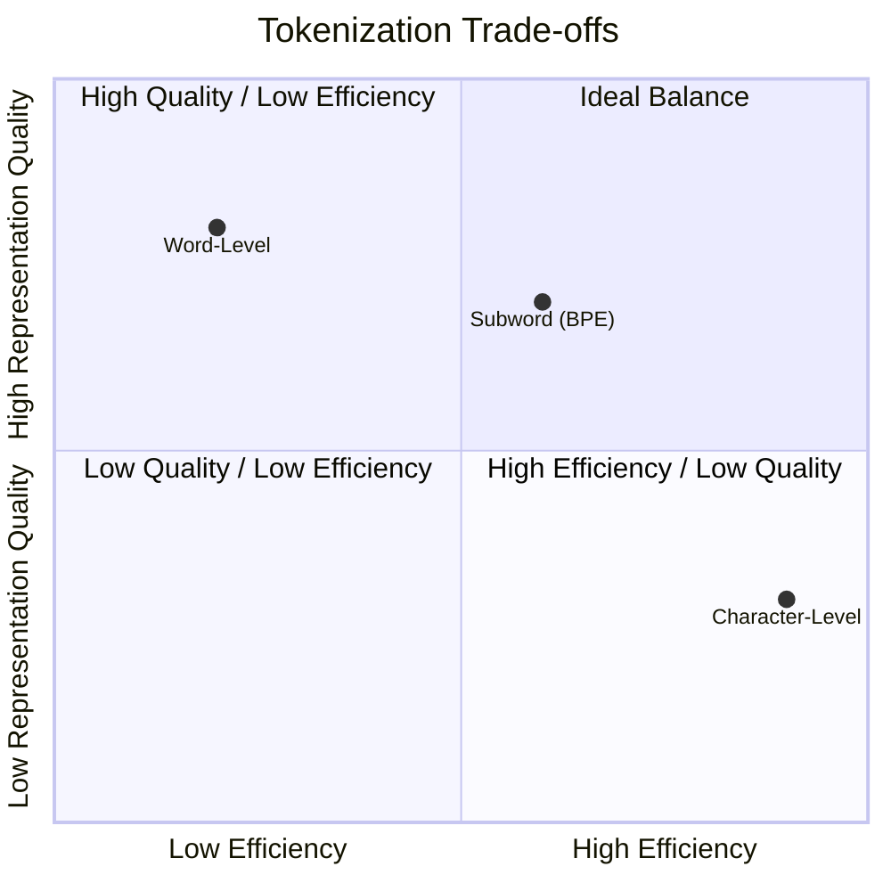

## Tokenization and Text Processing

### Introduction to Tokenization

- Tokenization is a core part of Natural Language Processing (NLP)
- It is the process of breaking text into smaller units, such as:
    - Words
    - Subwords
    - Characters
- **[Why it matters]** Tokenization is foundational for AI agents to analyze and generate human language; effective tokenization ensures accuracy and efficiency in text processing.

### Tokenization Techniques

- There are five main techniques used for tokenization:
    - Word
    - Subword
    - Character
    - Byte Pair
    - Sentence
- **Word Tokenization**
    - Involves splitting text into individual words
    - **[Why use it?]** To help the system understand language by treating each word as a distinct unit for generating human-like responses

### Subword Tokenization

- Divides words into smaller constituent units
    - Examples include prefixes, suffixes, and syllables
- **[Why use it?]** It is effective for handling out-of-vocabulary words and morphological variations
    - For example, the word `unhappiness` could be broken down into `un`, `happi`, and `ness`

### Character Tokenization

- Involves breaking text into individual characters
- **[Why use it?]** Useful for languages that lack clear word boundaries or when highly detailed text analysis is required
    - Example: `AI` becomes `A`, `I`

### Byte Pair Encoding (BPE)

- An algorithm that iteratively merges the most frequent pairs of subword units

### Byte Pair Encoding (BPE) Continued

- Iteratively merges the most frequent pairs of bytes to form sub-unit or subword units
- **[Why use it?]** It balances vocabulary size and representation efficiency
    - This approach is commonly used in transformer-based models
    - Example: the word `lower` could be split into `low-er`

### Sentence Tokenization

- The process of breaking text into individual sentences
- The process of breaking text into individual sentences
- **[Why use it?]** To save essential context
    - This is particularly useful for tasks like machine translation and summarization
- **Example:**
    - Input: `"AI is evolving. It impacts many sectors."`
    - Output: `"AI is evolving."` and `"It impacts many sectors."`

### Tokenization Examples

Using the input string: `"n8n is such a powerful tool!!"`

| Technique | Resulting Tokens |
| --- | --- |
| Word Tokenization | 'n8n', 'is', 'such', 'a', 'powerful', 'tool!!' |
| Subword Tokenization (BPE) | 'n8', 'n', 'is', 'such', 'a', 'powerful', 'tool!!' |
| Character Tokenization | 'n', '8', 'n', ' ', 'i', 's', ' ', 's', 'u', 'c', 'h', ' ', 'a', ' ', 'p', 'o', 'w', 'e', 'r', 'f', 'u', 'l', ' ', 't', 'o', 'o', 'l', '!', '!' |
| OpenAI Tokenization (BPE) | 'n', '8', 'n', ' is', ' such', ' a', ' powerful', ' tool', '!!' |

### Tokenization Comparison Continued

Using the example: `"n8n is such a powerful tool!!"`

- **Word Tokenization**
    - Often keeps punctuation attached to the final word
    - Example: `'n8n'`, `'is'`, `'such'`, `'a'`, `'powerful'`, `'tool!!'`
- **Subword Tokenization (BPE)**
    - Breaks non-words into smaller constituent units
    - Because `n8n` is not a standard word, it is split into smaller pieces
    - Example: `'n'`, `'8'`, `'n'`, `'is'`, `'such'`, `'a'`, `'powerful'`, `'tool!!'`

### OpenAI Tokenization (BPE)

- Used by AI models like GPT
- Utilizes a subword-based tokenizer
- **[Observation]** Unlike character tokenization, it tends to group common sequences together, including spaces and parts of words
    - Example from input: `"n8n is such a powerful tool!!"`
    - OpenAI tokens: `'n'`, `'8'`, `'n'`, `' is'`, `' such'`, `' a'`, `' powerful'`, `' tool'`, `'!!'`

### Comparison of Tokenization Granularity

| Technique | Granularity & Handling |
| --- | --- |
| Word | Splits by whitespace; punctuation often stays attached to the preceding word (e.g., 'tool!!') |
| Character | Every single character is its own token, including spaces and punctuation (e.g., 'n', '8', 'n', ' ', 'i', 's') |
| OpenAI (BPE) | Subword-based; often includes the leading space within the token (e.g., ' is', ' such') |

### Impact on Embeddings

- Tokenization directly influences how text is converted into numerical vectors, a process known as **embedding**
    - The way a word or subword is split determines the specific vector representation the model uses to understand its meaning

### Impact on Embeddings: Trade-offs

Tokenization granularity affects how meaning is captured and how the model handles different types of linguistic structures.

- **Granularity Levels**
    - **Word Level**: Captures full word meanings but struggles with rare words
    - **Subword Level**: Effectively handles rare and compound words
    - **Character Level**: Provides more detailed representations of words, languages, and their meanings
- **Vocabulary Size**
    - **Large Vocabulary**:
        - Captures a wider range of words
        - Requires more memory and higher computational resources
    - **Small Vocabulary**:
        - More efficient
        - Relies heavily on subword combinations to represent meaning
- **Sequence Length**
    - **Character-level tokenization**: Results in shorter sequences, which can lead to lower computational costs

#### Summary of Tokenization Impact

| Factor | Impact of Tokenization Strategy |
| --- | --- |
| Granularity of Tokens | Word-level captures full meaning but struggles with rare words; Character-level handles them well but increases sequence length |
| Vocabulary Size | Large vocabularies capture more range; Small vocabularies are more efficient but rely on subword combinations |
| Handling Out-of-Vocabulary (OOV) | Subword and character tokenization help generalize to unseen words |
| Sequence Length | Character-level tokenization results in much longer sequences, increasing computational cost |

### Impact on Embeddings: Generalization and Sequence Length

- **Generalization via Subwords/Characters**
    - Subword and character tokenization help the model construct embeddings for unseen words
    - **[Example]** If a specific term like `n8n` is in the vocabulary, the model treats it as one token; if not, it splits it into smaller pieces to still represent its meaning
    - This enhances the model's ability to generalize to new or rare text
- **Sequence Length**
    - Tokenization granularity directly impacts sequence length, which in turn affects processing
    - Finer-grained tokenization (like character-level) results in longer sequences, increasing computational costs

## Preprocessing Strategies

### Text Normalization

- **Lowercasing**
    - Converting all text to lowercase to ensure consistency across the dataset
- **Removing Punctuation**
    - Eliminating punctuation marks to reduce noise
    - **[Note]** Punctuation should only be removed if it doesn't carry significant meaning that would affect how an agent retrieves information

#### Expanding Contractions

- Converting words like `don't` into `do not`
- **[Why do this?]** To prevent inconsistent tokenization
    - Without expansion, a model might split `don't` into `don` and an apostrophe-based token like `'t`
    - Expanding ensures the semantic meaning is captured more clearly and consistently

### Stop Word Removal

- Removing common words that do not add significant meaning to the text
- **[Examples]**
    - a
    - of
    - on
    - I
    - for
    - with
    - the
    - at
    - from
    - in
    - to

### Stop Word Removal

- Common words that often lack significant meaning in certain contexts
    - Examples: `a`, `of`, `on`, `I`, `for`, `with`, `the`, `at`, `from`, `in`, `to`
- **[Decision Point]** Whether to remove them depends on the application
    - In some cases, they are essential for context and should be kept
    - In others, removing them can increase efficiency

### Stemming and Lemmatization

- **Stemming**
    - The process of truncating words to their root form
    - Example: `running` $\rightarrow$ `run`; `blanking` $\rightarrow$ `blank`
- **Lemmatization**
    - Reducing words to their base or dictionary form
    - **[Difference]** Unlike stemming, lemmatization takes the context into account to ensure the base form is accurate

### Handling Special Tokens

- **Padding**
    - Adds special tokens to the input
    - **[Why use it?]** To ensure uniform sequence length across all inputs
- **Start and End Tokens**
    - Tokens added to signify the beginning and the end of sentences or sequences
    - **[Why use it?]** To aid in specific tasks like machine translation

### Dealing with Noise

- Removing irrelevant information from the text
- **[Examples]**
    - URLs
    - HTML tags

### Dealing with Noise (Continued)

- **Removing irrelevant information**
    - URLs
    - HTML tags
    - Markdown
    - Other non-informative elements
- **Correcting spelling errors**
    - **[Why do this?]** Standardizing text reduces variability and improves the accuracy of how an agent interprets the content

## Pricing Considerations in Tokenization for API Usage

When using LLM services via APIs (such as OpenAI), tokenization strategy directly impacts operational costs.

- **Understanding Tokens**
    - Tokens are the "chunks of tot" (units of text) processed by the model
    - Example: `"ChatGPT is great!"` $\rightarrow$ `"Chat"`, `"GPT"`, `" is"`, `" great"`, `"!"`
- **Pricing Structure**
    - Most APIs use per-token billing
    - **[Example]** OpenAI's GPT-4o might charge 8.90 dollars per 1,000,000 input tokens
- **Cost of Tokenization**
    - **Fine-grained tokenization** (e.g., character-level): Increases token count, which directly raises costs
    - **Efficient tokenization**: Balances detail with cost-effectiveness by grouping common sequences into single tokens

### Token-to-Word Ratio

- In English, there is a rough approximation for how much text a set of tokens covers:
    - 1,000 tokens $\approx$ 750 words

### Pricing Structure

- **Per-token billing**
    - Most APIs charge based on the total number of tokens processed
    - Billing includes both **input tokens** (what you send to the model) and **output tokens** (what the model generates)
- **Model-specific pricing**
    - Costs vary significantly between different models
    - **[Example]** GPT-4o mini is considerably cheaper than the standard GPT-4o

### Model-Specific Pricing Variability

- **Model tiers and costs**
    - Prices vary significantly between different model versions
    - Some versions (e.g., "Turbo" models) can be more expensive
    - **[Warning]** Without monitoring, you could accidentally run an agent that costs 1.00 dollar per call instead of using a cheaper version like `GPT-4o mini`, which might cost as little as 0.015 dollars per 1,000 input tokens