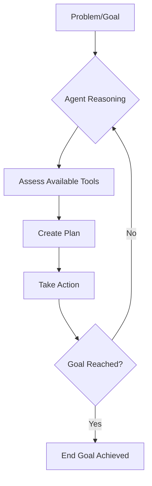
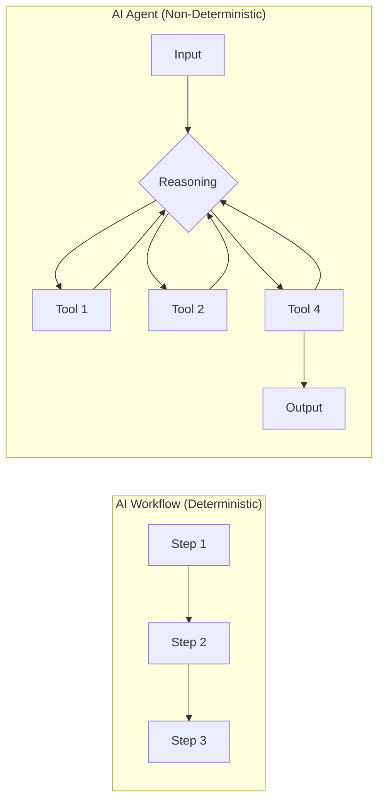
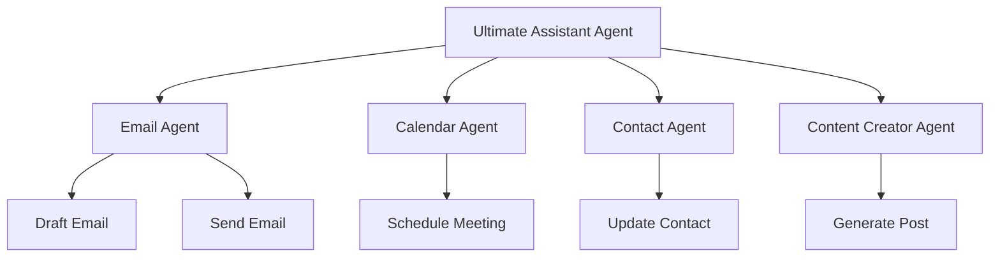

## Introduction to AI Agents

- Described as the "really fun stuff"
- Likely what led to joining the AI community
- Reason why YouTube feeds fill with AI and AI agents content
- Reference to first YouTube video: "How I Wish Someone Explained AI Agents to Me as a Beginner"
- Marks the point of understanding AI workflows

## AI Agents

- Definition: An autonomous system that can make decisions and take actions based on input and context
    - This distinguishes them from traditional AI workflows, which are typically more rigid or linear

### AI Agents vs. Traditional AI Workflows

- **Traditional AI Workflows**
    - Highly rigid and predefined
    - Follow a strict sequence of steps (e.g., Step 1 $\rightarrow$ Step 2 $\rightarrow$ Step 3)
- **AI Agents**
    - Flexible and adaptive
    - Capable of autonomous reasoning to solve a problem through a specific cycle:

        1. **Understand the problem**: Analyze the input and goal
        2. **Tool assessment**: Identify which available tools can help
        3. **Planning**: Formulate a strategy to reach the end goal
        4. **Action**: Execute the plan

- **Workflows as Tools**
    - Intelligent AI workflows can be treated as individual tools
    - An agent can be given access to these workflows to perform complex tasks within set parameters

### AI Agent Decision-Making and Workflow Execution

- When an agent faces a problem, it performs a selection process:
    - It evaluates the different workflows it has access to
    - It identifies which specific workflow is best suited to solve the current problem
    - It then activates (or "fires off") that specific workflow to proceed
- **[Why this matters]** This ability to choose between multiple specialized paths is what enables true autonomy compared to rigid, linear workflows

### AI Agents as Remote Employees

- The capabilities of an AI agent can be broadly compared to hiring a remote employee
- **[Why?]** Because they can perform tasks that require interacting with software and digital environments
- **Action Methods**:
    - **API access**: Directly communicating with servers to execute commands
    - **UI Automation**: When APIs are unavailable, agents can use browser automation or Robotic Process Automation (RPA)
        - This allows them to interact with a system just like a human would (e.g., moving the mouse, clicking buttons, and navigating interfaces)

### The Value Proposition of AI Agents

- **Autonomous Reasoning**: Agents use Large Language Model (LLM) "brains" to perform tasks autonomously
- **Key Advantages over Humans**
    - **Perfect Memory**: Unlike humans who may misremember details, agents operate based strictly on the data and context provided to them
    - **Instruction Adherence**: They are designed to follow instructions precisely
- **[Caveat]** While highly reliable, they are not perfect and can still experience hallucinations

// Append to existing notes

### Operational Advantages of AI Agents

- **24/7 Availability**
    - Unlike humans, agents never need to sleep
    - **[Requirements for continuous operation]**
        - Active workflows
        - Sufficient compute resources
        - Properly configured credentials and account credits
- **Cost Efficiency**
    - Operating an agent costs a fraction of hiring a human
    - **[Why?]** Agents eliminate traditional employment overhead such as:
        - Salaries
        - Benefits
        - Periodic raises

### Key Components of an AI Agent

- The architecture of an agent consists of two primary internal elements:
    - **Brain**: The Large Language Model (LLM) that powers the entire system and handles reasoning
    - **Instructions**: Provided in the form of a **system prompt** to guide how the agent should behave and operate

### The Core Architecture of an AI Agent

- An agent is composed of three essential pillars:
    - **The Brain**: A Large Language Model (LLM) that provides reasoning and decision-making capabilities
    - **Memory**: Can be short-term, long-term, or a combination of both to maintain context and history
    - **Tools**: External capabilities that allow the agent to take action
- **[The Role of Tools]** Tools transform an agent from a chatbot into an active participant by giving it the ability to interact with digital systems
    - **Examples of tools**:
        - APIs
        - Databases
        - Specific functions (e.g., sending emails)
        - Accessing a CRM
- **The Operational Loop**:

    1. The agent receives an **Input**
    2. The agent uses its **Brain** to think and reason about the input
    3. The agent selects and utilizes the appropriate **Tools** to execute the task

### The Agent Operational Loop

- The complete cycle of an agent's interaction follows these steps:

    1. **Input**: Receives a request or data
    2. **Reasoning**: Uses its brain and instructions to process the input
    3. **Tool Use**: Executes actions using the available tools
    4. **Evaluation**: Reviews the outcome of the actions
    5. **Output**: Sends back a final result or response

### Real-World Analogy: Brushing Your Teeth

- To understand the architecture, consider the daily task of brushing teeth:
    - **Reasoning**: The decision-making process (deciding *when* and *where* to brush)
    - **Tools**: The physical items used to perform the action (toothbrush and toothpaste)
    - **Memory**: Personal context and history (preferences, or your current status, such as whether you have already brushed today)

### The AI Agent Operational Loop

- The agent follows a continuous cycle to process tasks:

    1. **Recognize Input**: Understand the initial request or data provided
    2. **Determine Tools**: Identify which specific tools are required to complete the task
    3. **Utilize Memory**: Incorporate relevant context from short-term or long-term memory
    4. **Plan and Execute**: Formulate a strategy and carry out the necessary actions
    5. **Output**: Return the final result or completion status to the user

### Frameworks vs. Workflow Builders

- **n8n**:
    - It is a **no-code workflow builder**
    - **[Clarification]** It is not an agentic framework itself, but rather the system used to construct and orchestrate the agents and their workflows
- **Agent Frameworks**: Different specialized systems designed specifically to provide the structure and logic for agentic behavior (to be discussed further)

### AI Agent Frameworks

- Various frameworks exist to help build and manage agents:
    - **Azure AI Agent Service**
    - **Semantic Kernel**
    - **LangChain**: One of the most well-known frameworks
        - **[Purpose]** It acts as a way for code to talk to tools
        - It standardizes the process of "tool calling" at a high level
    - **Hugging Face** (referenced)
- **[Golden Rule for Automation]** If your focus is on building end-to-end workflow automation, do not worry about the underlying mechanics or the specific differences between these frameworks. Focus on the automation rather than the technical implementation details of the frameworks themselves.

### n8n and LangChain Integration

- **[Clarification]** n8n is not built on LangChain
- **LangChain Integration in n8n**
    - n8n offers integration through specific nodes
    - **[Purpose]** This integration is used when accessing certain APIs or native n8n nodes to take action in other systems
    - It allows the system to use LangChain to standardize requests and actually execute the intended actions

### AI Workflows vs. AI Agents

| Aspect | AI Agents | AI Workflows |
| --- | --- | --- |
| Decision-making | Autonomous reasoning and selection | Predefined paths |
| Autonomy | High (self-directed) | Low (fixed execution) |
| Flexibility | Adaptive to changing conditions | Rigid sequence |
| Cost | Lower long-term (scalable) | Predictable but limited |

### Autonomy and Determinism

- **AI Workflows**
    - Follow predefined, controlled paths
    - Offer less autonomy because the human/developer dictates the sequence
- **AI Agents**
    - Highly autonomous and responsive in their decision-making
    - **Non-deterministic**: The sequence of actions is not fixed
        - An agent might have access to multiple tools (e.g., Tool 1, Tool 2, Tool 4)
        - The agent could choose any combination or order (e.g., Tool 1 $\rightarrow$ Tool 2 $\rightarrow$ Tool 4 OR Tool 4 $\rightarrow$ Tool 4 $\rightarrow$ Tool 1)
        - This creates an infinite number of possible execution paths

### AI Workflows vs. AI Agents: Use Cases

- **AI Workflows**
    - Best for **repeatable, stable, predictable, and repetitive processes**
    - **[Ideal Scenario]**: When a Standard Operating Procedure (SOP) exists
        - If you have a set of 10 steps that must happen in a specific order every single time, this is the prime use case for a workflow
        - Result: Lower autonomy, but high reliability for known patterns
- **AI Agents**
    - Best for tasks requiring **adaptability**
    - Used when the path to a solution isn't fixed and requires reasoning to navigate changing conditions

### Adaptability: Workflows vs. Agents

- **AI Workflows**
    - Best suited for **predictable, stable, and repetitive** processes
    - **[Ideal Use Case]** When you have a clearly defined **Standard Operating Procedure (SOP)**
        - If you know the 10 steps and they must happen in a specific order every time, a workflow is the prime choice
- **AI Agents**
    - Best suited for **dynamic and flexible** environments
    - **[Ideal Use Case]** When the logic is non-deterministic and requires conditional reasoning
        - Use agents when the process involves "if this happens, then we could do this" logic
        - Agents handle complex, nested logic where the path is not fixed and must adapt to the situation

// Append to existing notes

### Tool Calling in AI Agents

- **Definition**: Tool calling gives agents the ability to interact with external systems
- **[Why it matters]** Enables direct action instead of manual intervention
    - **Without tool calling**: Manually copy-paste (e.g., use ChatGPT to write an email, then copy it and paste into Gmail browser)
    - **With tool calling**: Agent executes the action by communicating directly with the external system

### Key Concepts in Tool Creation

To enable an agent to interact with external systems (like writing and sending an email via Gmail), you must define the tool through four critical stages:

1. **Tool Creation**

    - Define the function itself
    - Define its specific purpose
    - Define the requirements/parameters needed for the function to work

2. **Tool Binding**

    - Connect the defined tool to an AI model that supports tool calling

3. **Tool Calling**

    - The model decides when it is appropriate to invoke the tool
    - The model determines which specific tool to call and what data to pass into it

4. **Tool Execution**

    - The tool runs using the provided arguments
    - The tool returns the resulting data back to the agent

### Tool Binding

- The process of connecting a defined tool to an AI model
- **[Requirement]** The model must specifically support tool calling
    - An example of a model with this capability is GPT-4o

### Reasoning Models vs. Tool Calling

- **The Current Gap**: Most current reasoning models (e.g., GPT-o1) do not yet support standardized tool/function calling
    - They are highly capable of the "thinking" and "planning" phases
    - However, they cannot yet transition from planning to execution by triggering a tool
- **[The Future Potential]**: Combining high-level reasoning with tool calling will be a game-changer
    - **Current State**: A reasoning model can look at a problem and a list of tools and say, "I should use Tool A to solve this."
    - **Enhanced State**: A reasoning model can look at a problem, identify the tool, and then *actually execute* the action via that tool
    - This bridges the gap between an agent that just makes a plan and an agent that can actually take action

### Tool Calling and Execution

- **Tool Calling**: The decision and data transfer phase
    - The model determines *when* it is appropriate to use a specific tool
    - It selects the correct tool and prepares the necessary data/arguments to pass to it
- **Tool Execution**: The actual performance of the task
    - The tool runs using the provided arguments
    - It carries out the action in the external system
- **[Why this is transformative]** This process shifts agents from being mere text generators to practical, actionable systems
    - **Beyond Natural Language**: Instead of just talking about a task, the agent can actually *do* it (e.g., updating a record, sending an email)
    - **Deep Integration**: Enables agents to work seamlessly within a company's specific:
        - Business logic
        - Infrastructure
        - Tech stack

### Practical Example: Customer Support Agent in n8n

Using n8n, an agent can be configured to act as a specialized employee within a specific environment.

- **Agent Configuration**:
    - **Brain**: GPT-4o
    - **Tool 1**: Vector store containing company data (for knowledge retrieval)
    - **Tool 2**: Gmail tool (specifically for creating drafts)
- **[Operational Requirement]** Just like a remote human employee, the agent requires proper **credentials, permissions, or authorization** to perform actions within the company's digital environment.

### Agents within Agents (Hierarchical Agents)

- You can build complex systems by nesting agents inside other agents
- **The Ultimate Assistant**: A master agent that acts as an orchestrator for multiple specialized sub-agents
- **[How it works]** When the master agent determines a specific task is needed, it calls upon the relevant sub-agent to handle it
- **Examples of specialized sub-agents**:
    - **Email Agent**: Handles drafting and sending communications
    - **Calendar Agent**: Manages scheduling and appointments
    - **Contact Agent**: Manages contact information and relationships
    - **Content Creator Agent**: Focuses on generating specific types of content

### Sub-Agent Reasoning and Tool Selection

- When a specialized sub-agent (like an Email Agent) is activated, it performs its own reasoning process:
    - It evaluates the specific request against its own specialized set of tools
    - **[Example: Email Agent capabilities]**
        - Get emails
        - Mark as unread
        - Label emails
        - Write a reply
- **[Why use sub-agents?]** To prevent **Tool Confusion**
    - If a single master agent is connected to every possible tool (e.g., 8 email actions + 8 calendar actions + 8 contact actions = 24+ tools), the model can become overwhelmed
    - Too many tools make it harder for the model to accurately select the correct one, leading to errors or poor decision-making
    - Hierarchical structures keep the toolset for each agent small and focused, ensuring higher accuracy and reliability