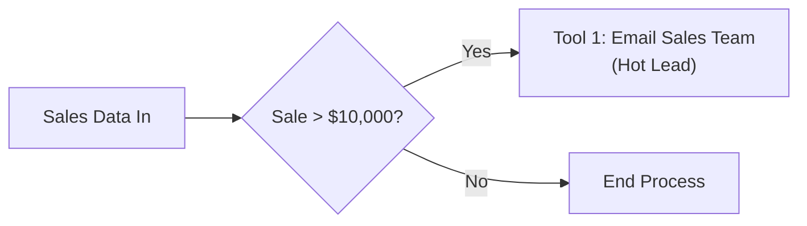
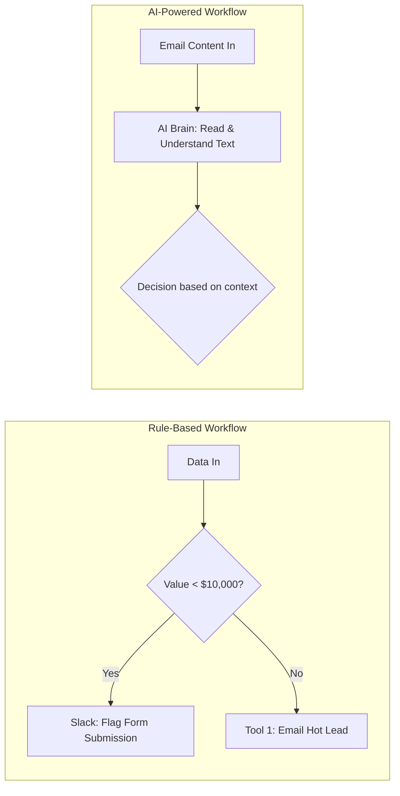
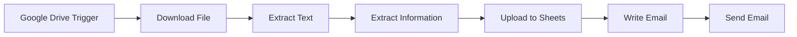
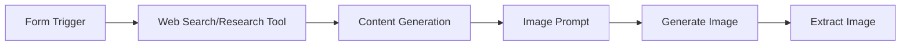

## Understanding AI Workflows

### What is a Workflow?

- A sequence of steps designed to complete a specific task or process
- It outlines several key components:
    - Who does what (roles)
    - In what order (sequence)
    - Using which tools

### Characteristics of Workflows

- Often implemented via automation tools
    - Steps must be clearly defined
    - Actions are triggered by specific inputs
- **[Example]** Customer Service workflows
    - A classic example where a process is triggered by an incoming event (e.g., a support ticket being submitted)

### Customer Service Workflow Example

- A sequence triggered by a customer complaint via a website ticket
    - **Step 1: Input & Categorization**
        - The customer submits a ticket and selects an issue type from a dropdown menu (e.g., "Triage")
    - **Step 2: Conditional Logic (Branching)**
        - The workflow evaluates the input: "If it's this type, I'm going to go this way"
    - **Step 3: Execution & Resolution**
        - The ticket is automatically assigned to the specific triage team
        - The team resolves the issue
        - The workflow automatically closes the ticket
- **[Tools]** Automation platforms like Zapier and Make are popular for setting up these types of workflows

### Evolution of Automation Tools

- Platforms like Zapier and Make became popular by making automation intuitive and accessible through a no-code approach
    - Users can set up "zaps" or automations by defining a simple sequence:

        1. **Trigger**: What event starts the process?
        2. **Action**: What do you want to happen next?
        3. **End**: What concludes the process?

    - **[Benefit]** Even simple workflows with only 4 or 5 steps can save massive amounts of time and money

### Hiring Workflow Example

- A standard sequence of steps used to manage recruitment:
        - Post a job
        - Collect resumes
        - Schedule interviews
        - Make offers

### Expanding the Concept of Workflows

- Workflows can be applied to almost any structured process, including:
    - Professional processes: e.g., onboarding a new employee
    - Personal routines: e.g., a morning routine (wake up $\rightarrow$ brush teeth $\rightarrow$ make coffee $\rightarrow$ check calendar)
- **[Key Concept]** Workflows are essentially a sequence of steps that act as a Standard Operating Procedure (SOP)

### Traditional vs. AI Workflows

- The distinction between a standard workflow and an AI workflow lies in predictability:
    - **Traditional Workflows**: Built when there are predictable inputs, predictable outputs, and a predictable sequence of steps
    - **AI Workflows**: Utilized when the process is not as predictable, often involving AI agents to navigate uncertainty

### Rule-Based Workflows

- These are predictable workflows that do not use AI
- They rely on strict logic to handle incoming data
- **Example: Sales Lead Processing**
    - **Input**: Sales data comes in
    - **Condition**: If the sale is greater than 10,000 dollars
    - **Action**: Trigger Tool 1 to email the sales team, labeling it a "hot lead"

### Rule-Based vs. AI-Powered Workflows

- **Rule-Based Routing (Non-AI)**
    - Uses simple filters to direct data based on specific values
    - **Example: Sales Processing (continued)**
        - **Condition**: Sale is less than 10,000 dollars
        - **Action**: Flagged in Slack as a standard form submission
- **AI-Powered Workflows**
    - Requires an LLM or "AI brain" to interpret unstructured data
    - Instead of looking at a single number or field, the AI must read and understand the actual meaning of the content
    - **Example: Email Processing**
        - **Input**: An incoming email
        - **Process**: The AI reads the text within the email to understand the context and intent before deciding on the next step

### Why AI-Powered Workflows are Necessary

- Traditional filters and code cannot handle tasks requiring interpretation
- **The Reasoning Gap**
    - A filter can check if a value is "$10,000"
    - An AI can read the text of an email to determine if the intent is a "complaint," "billing issue," or "promotion"
    - This requires understanding the combined meaning of words through reading and reasoning

### Benefits of Workflows

- **Clarity & Structure**: Defines roles and ensures everyone knows what comes next
- **Efficiency**: Automates repetitive tasks to save time
- **Consistency**: Ensures processes are repeated the same way every time
- **Accountability**: Makes it clear who is responsible for specific steps

### The History of Workflow Automation

- Automation is not a new concept; it has been around in various forms since the 1980s
- **Evolution of Automation Systems**
    - Gained significant traction in the 1990s and 2000s
    - Key systems that drove this growth include:
        - Enterprise Resource Planning (ERP) systems
        - Customer Relationship Management (CRM) platforms
        - Robotic Process Automation (RPA)
            - RPA is characterized by automating specific, repetitive actions, such as coding a mouse to move to a specific pixel on a screen

### Robotic Process Automation (RPA) Detail

- Used to automate highly repetitive, manual-like digital actions
    - Example: Coding a mouse to move to a specific pixel and click a button
    - Use case: Automating the daily process of downloading a specific file by clicking the same buttons in the same locations every day

### Modern Evolution of Automation

- Automation has evolved dramatically in recent years
- **Cloud Computing**
    - A key driver of this evolution
    - Allows for hosting servers to power more complex, scalable automation processes

### Drivers of Modern Automation

- **Cloud Computing**
    - Provides access to virtual machines in the cloud
    - Eliminates the need for expensive on-premise hardware
        - No need for dedicated server rooms with specialized cooling and fans
- **APIs (Application Programming Interfaces)**
    - Allows different software applications to "talk" to each other
    - This connectivity is the foundation of how automated systems move data between tools
- **AI (Artificial Intelligence)**
    - Adds a layer of intelligence to traditional automations
    - Enables workflows to move beyond simple rules to tasks involving reasoning and understanding

### The Transition to AI Automation

- Traditional automation often hits a bottleneck when a process requires human judgment
    - Example: An automation sends an email to a manager asking for approval (yes/no)
    - The manager must manually intervene to keep the workflow moving
- AI automation solves this by using an LLM to perform the reasoning step
    - Instead of waiting for a human, the AI can "read" the context and make the decision
    - This allows the workflow to continue autonomously through tasks that previously required human interpretation

## Key Questions in Building AI Workflows

### What problem am I solving?

- Start by clearly defining the specific task or decision point you intend to automate
- **[Evaluating the need for AI]** Determine if the task actually requires intelligence or just simple rules
    - If the process follows clear, predictable logic (e.g., "if A and B, then C"), traditional automation is likely enough
    - AI is unnecessary for tasks that can be handled by straightforward conditional filters

### Does this task need AI?

- Use the following criteria to decide if a process requires an LLM or just traditional automation:

| Requirement | AI Needed? |
| --- | --- |
| Requires understanding of language/nuance | ✅ Yes |
| Needs pattern recognition in messy data | ✅ Yes |
| Follows clear rules with yes/no logic | ❌ No |
| Repetitive with predictable outcomes | ❌ No |

- **[The Nuance]** A task might be repetitive, but if that repetition includes an element of **reasoning**, then AI is still necessary.

### Categorizing Decisions by Structure

- The level of structure in a decision determines whether you use traditional automation or AI
- **Decision Types**:
    - **Structured Decisions**: Follow clear, predefined rules
    - **Semi-structured Decisions**: Somewhere in the middle; AI can be highly beneficial here to assist or bridge gaps
    - **Unstructured Decisions**: No clear rules or patterns exist
        - Requires subject matter expertise or a "human brain" to understand the context
        - This is where AI automation is most essential

### How Decisions are Made in Workflows

- **Traditional Workflow Decision-Making**
    - Relies on matching specific, predictable data points
    - **Methods include**:
        - Keyword matching
        - Form field data
        - Dropdown selections
    - **Result**: Typically triggers a pre-written, static response
- **AI-Powered Decision-Making**
    - Moves beyond simple matching to interpret the actual meaning and context behind the data

### AI-Powered Decision-Making (continued)

- **Traditional Workflow Response**: Uses pre-written, static templates
    - Can use **placeholders** to add a personal touch (e.g., "Hey [Customer Name]")
    - This is still rule-based automation, not AI
- **AI-Powered Workflow Response**: Uses reasoning to generate content
    - **Process**:

        1. AI reads the incoming customer email
        2. AI understands the **sentiment** and **context**
        3. AI creates a **personalized response**

    - **[Human-in-the-loop]** A human can review the AI-generated response before it is officially sent

### What Data Do I Have?

- AI requires high-quality data to function effectively
- **Types of Data to Consider**:
    - **Input Data**: The raw information entering the system (e.g., a customer request + order history)
    - **Training Data**: Data used to teach the AI (e.g., past customer conversations)
    - **Validation Data**: Data used to check if the AI is producing the correct output (e.g., 10% sample with correct outputs)

### The 'Three Things' Framework

- When building a workflow, simplify the process by focusing on three core components:

    1. **Input**: What the agent receives (e.g., a customer request)
    2. **Processing**: What the agent looks at and how it interprets the data
    3. **Output**: What the agent does with the information

- **The Foundation (Input Data)**
    - You must first understand exactly what the system receives to set up the rest of the workflow
    - Identifying the input allows you to properly configure:
        - Rules
        - Placeholders
        - Variables

### What Data Do I Have? (continued)

- **Training Data**
    - Used to guide the agent on how to behave or what to look at
    - **Implementation**: Often included in the prompts to show the agent what a successful conversation or response looks like
- **Validation Data**
    - Used to verify the quality of the AI's work
    - **Purpose**: Allows the system to compare its generated output against examples of correct outputs to ensure accuracy
    - **[Analogy]** This follows the same principle as fine-tuning LLMs, where the model adjusts its weights by learning from high-quality responses

### Building Reliable AI Workflows

- To ensure an automation is effective and safe, it is recommended to work with a structure that includes guardrails
- **Key Components for Reliability**:
    - **Decision Gate**: A point where the workflow evaluates information to decide the next path
    - **AI Action**: The specific step where the LLM performs reasoning or content generation
    - **Human Checkpoint**: A manual review step to ensure the AI's output meets quality standards
        - **[Why use it?]** It allows you to verify the automation and its guardrails before fully trusting it to run autonomously
    - **Fallback Plan**: A contingency for when the AI gets stuck or fails
        - **Example**: If the AI cannot resolve a task, the fallback might be to request human assistance
        - **[Importance]** Prevents the workflow from reaching a dead end where no further progress can be made

### Examples of AI Workflows

- Workflows can vary significantly in complexity, but they all share a fundamental characteristic: a clear, sequential path.
- **[Key Principle]** Steps must occur in a specific order; a workflow cannot skip ahead or loop back unpredictably (e.g., you cannot write an email before downloading the file it contains).

#### Complex Workflow Example: Document Processing

- This workflow demonstrates a multi-step sequence to handle files:

    1. **Google Drive Trigger**: The process starts when a file is detected.
    2. **Download File**: The file is retrieved from the drive.
    3. **Extract Text**: The content is read from the file.
    4. **Extract Information**: Specific data points are identified from the text.
    5. **Upload to Sheets**: The extracted data is sent to a spreadsheet.
    6. **Write Email**: An email is drafted based on the information.
    7. **Send Email**: The final step completes the process.

#### Simple Workflow Example: Social Media Automation

- A shorter sequence used for content creation:

    1. **Form Trigger**: A form submission starts the process.
    2. **Create LinkedIn Post**: The workflow proceeds to generate content for social media.

### Agentic vs. Mandatory Tool Use

When building workflows, you can decide how an AI agent interacts with external tools (like a web search tool):

- **Optional (Agentic) Tool Use**
    - The tool is provided to the AI agent as an available capability.
    - The AI decides whether or not to use the tool based on the prompt and the context of the task.
    - **[Result]** The tool may not be used every time the workflow runs.
- **Mandatory (Hard-coded) Tool Use**
    - The tool is placed as a specific, dedicated step in the workflow sequence.
    - **[Example]** Placing a research tool directly after a form trigger:

    - **[Result]** Because the tool is a fixed step in the sequence, it is executed every single time the process kicks off.

### The Nature of AI Workflows

- AI workflows are characterized by being **linear**, **predictable**, and **deterministic**
    - **Linearity**: The process follows a specific, sequential path
    - **Predictability**: You always know exactly what is coming in (input) and what is coming out (output)
    - **Full Control**: You have complete control over the order of operations
- **[Example] Video Generation Workflow**
    - Even highly complex processes like generating a video must follow a strict sequence:

        1. Generate individual components
        2. Render everything together
        3. Send the final product

    - This process cannot skip steps or move out of order; it must follow the established flow.

### Introduction to AI Agents

- The discussion transitions from structured, step-by-step workflows to the concept of AI agents.
- While workflows follow a predefined sequence, agents represent a more autonomous way of interacting with tasks and tools.