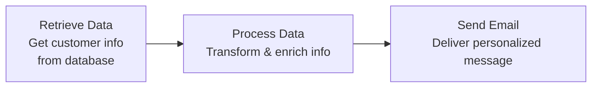

## The Complete Beginner's Guide to JSON

- **Your gateway to mastering modern web communication**
    - JSON may sound intimidating but it's really really simple
    - Goal: get familiar with what JSON is and why it's important to understand
    - Not about coding agents or complex coding — just the basics

### What is JSON?

- **JSON (JavaScript Object Notation)**: lightweight, text-based data format for storing and exchanging information between applications, websites, and systems
    - Despite the name, completely language-independent — universal standard for web data exchange
- **Analogy to make it stick**: like filters when ordering food/clothes online (restaurant, side, color, size, style)
    - Really simple way to think about it
- **Big picture**: standardized filing system everyone agrees on for sharing data

### JSON in Real-World Use

- **Practical examples**: When building an agent that talks to Gmail, that's JSON
    - Also for a system that researches information — both sending requests and getting data back use JSON
- **Key role**: Universal format for requests and responses in agent communication and data exchange

### Key Benefits of JSON

- **Universal accessibility**: If JSON looks confusing, paste it into ChatGPT, Claude, Gemini, Grok, or similar — all AI models trained extensively on it and understand it perfectly
    - Removes intimidation factor completely
- **Video goal**: High-level overview to learn what JSON is, how to read it well — super easy by the end

### JSON Structure: Key-Value Pairs

- JSON built on **key-value pairs** — like a dictionary with words (keys) and their definitions (values)
    - Makes it intuitive: read as straightforward descriptions

```json
{
  "name": "Sarah",
  "age": 28,
  "city": "New York"
}
```

- **Key components**:
    - **01 The key**: Always a string in double quotes
    - **02 The colon**: Separates key from value
    - **03 The value**: Can be any JSON data type
- **Why it clicks**: Person's name is Sarah, age 28, city New York — just filters describing data

### JSON Numbers vs Strings

- **Numbers**: Integers or decimals, no quotes

```json
"age": 25
```

    - If wrapped in double quotes (e.g. "25"), treated as a **string** by computer/agent/service
- **Dates often as strings**: e.g. "April 19th" or "2025-9-whatever" — both strings because quoted
- **Numbers practical tip**: No double quotes means computer treats as number → can do math (add, average ages)
    - **Why it matters**: Can't average strings (e.g. if "25" quoted) → get errors
    - **Fix**: Convert string ages to numbers for summarization/calculations
- **Transition**: Booleans look like strings but... (coming up)

### JSON Booleans, Null, Objects, and Arrays

- **Booleans**: `true` or `false` values, no double quotes
    - Distinguishes from strings (which would be `"true"`)
    - Example: `"isActive": true`
- **Null**: Represents empty or undefined, literally `null` (no double quotes)
    - Super easy to spot
    - Example: `"middleName": null`
- **Objects**: Collections of key-value pairs wrapped in `{}`
    - Builds nested structure
    - Example: `{"name": "Alice"}`
- **Arrays**: Ordered lists of values in `[]`
    - Holds multiple items
    - Example: `["red", "blue"]`
- **Objects in action**: Hold mixed data types in one structure to represent something complete, like a person
    - Example: `{"name": "Sarah" (string), "age": 28 (number), "city": "New York" (string)}`
    - Flexible: Can mix strings, booleans, numbers — whatever fits
- **Arrays deeper**: Ordered lists of values (not key-value, just sequenced items)
    - Practical example: Shopping list as `["apples", "bananas", "grapes", "meat", "potatoes"]`
    - Holds any values in order — great for lists like colors `["red", "blue"]` or inventory

```json
["apples", "bananas", "grapes", "meat", "potatoes"]
```

- **Why arrays shine**: Maintain order and group similar items without keys
- **Arrays with numbers**: Hold sequences like `1, 2, 5, 7, 12, 1, 2, 6` — just a list in square brackets
- **Nesting**: Arrays can live inside objects for more complex structures
- **Pro tip when stuck**: JSON reads like natural language, but if confusing, copy-paste into chat + "what am I looking at?" → instant explanation
- **Real-world example**: Customer order JSON combines all data types in nested structure
    - Top-level object with `orderId` (string: `"ORD-2025-001"` — numbers inside but quoted = string)
    - Nested `customer` object:
        - `firstName`: string (`"Emma"`)
        - `age`: number (`29`)
        - `isPremiumMember`: boolean (`true`)
    - `items` array containing objects:
        - Each item object: `productName` (string), `quantity` (number), `price` (number: `149.99`)
    - `orderTotal`: number (`199.97`)

```json
{
  "orderId": "ORD-2025-001",
  "customer": {
    "firstName": "Emma",
    "age": 29,
    "isPremiumMember": true
  },
  "items": [
    {
      "productName": "Headphones",
      "quantity": 1,
      "price": 149.99
    }
  ],
  "orderTotal": 199.97
}
```

- **Key insight**: All JSON types nest seamlessly (objects in objects, arrays of objects) to model real scenarios like transactions — read the braces/brackets + quotes to identify types instantly
- **Pro tip extension**: Ask chat "which are strings vs numbers?" for breakdown of any JSON
- **Grouping logic**: Fields like `firstName` (string: "Emma"), `age` (number: 29), `isPremiumMember` (boolean: true) nest inside `customer` object
    - Reason: All relate directly to the customer — keeps related data together
- Objects nest flexibly: objects inside objects, arrays inside objects
    - Builds complex real-world structures like transactions
- **Next up**: `items` array holds list of item objects (e.g., productName string, quantity/price numbers)
- **Items array breakdown**: Holds objects for each product
    - `productName`: string (`"Headphones"`)
    - `quantity`: number (`1`)
    - `price`: number (`149.99`)
- `orderTotal`: number (`199.97`) — final calculated amount
- **Full structure ties together**: Top-level object nests `orderId` (string), `customer` (object), `items` (array of objects), `orderTotal` (number)

### JSON Powers AI Automation

- **Core role**: Universal format for passing data between automation steps (nodes in workflows)
    - Enables seamless data flow in AI agents/tools
- **Example workflow**:



- **Why JSON?** Handles all data types across steps — prerequisite for building automations

### JSON in HTTP Requests and API Communication

- **Why JSON matters for automation**: Essential when transferring variables between nodes (Retrieve Data → Process Data → Send Email) and making requests to services
    - Standardized format extracts specific info (e.g. `userId`) for subsequent steps
- **HTTP Requests example**: JSON sent to API and response received
    - **Sending to API** (request body):

```json
{
  "action": "create_user",
  "userData": {
    "name": "Sarah Davis",
    "email": "sarah@company.com"
  },
  "notifications": {
    "sendwelcomeEmail": true
  }
}
```

    - **Receiving Response**:

```json
{
  "success": true,
  "userId": "USER-789",
  "message": "User created",
  "nextSteps": [
    "send welcome email",
    "Add to calendar"
  ]
}
```

- **Key benefit**: Automation pulls out fields like `userId` or `nextSteps` array to drive actions (e.g. send email, add to calendar) — all types (string, boolean, array) work together seamlessly

### Agent-to-CRM Requests

- **Context**: AI agent sends structured JSON payload to CRM systems
    - Specifies `action: "create_user"` with `userData` object (name, email)
    - Real-world example: Instructing CRM to create user for Sarah Davis at sarah@company.com
- **Notifications object**: Controls additional actions like `sendWelcomeEmail: true` (camelCase)
    - Natural language equivalent: 'Go create a user in the database for Sarah Davis (email: sarah@company.com) **and** send her a welcome email'
- **Response expectation**: After sending JSON request, API responds like human confirmation
    - Returns `success: true`, `userId: "USER-789"`, `message: "User created"`, `nextSteps` array (e.g., "send welcome email", "Add to calendar")

### JSON Syntax Rules

- **Use Double Quotes**: All strings and keys must use double quotes — single quotes don't work
- **No Trailing Commas**: Don't add commas after the last item in objects or arrays
- **No Comments Allowed**: JSON files cannot contain comments
- **Unique Keys**: Keys must be unique within each object
- **Proper Nesting**: All brackets `[]` and braces `{}` must match correctly
- **Why rules matter**: Ensures JSON parses universally across systems without errors — violation breaks automation
- **Debugging broken JSON**: Copy-paste into chat (Gemini/ChatGPT/Claude) and ask "my JSON's not working, what's wrong?"
    - AI spots issues instantly: missing comma, extra space, wrong double quote
    - Personal workflow: Quick scan first (e.g. for obvious commas), then AI if needed, paste back into tool

### Getting Started with JSON

- **Practice Reading JSON**
    - Study examples: Identify data types (strings, numbers, etc.)
    - Explore public API samples
- **Use JSON Validators**
    - Tools like JSONLint: Check formatting automatically
- **Experiment & Build**
    - Start simple: Basic key-value pairs
    - Progress to complex: Nested objects/arrays
- **Big picture**: JSON unlocks modern automation + API integration — don't be intimidated, familiarity grows with exposure

### Mastering JSON Through Reps & Exposure

- **Key to Proficiency**: JSON 'clicks' with repetition and familiarity — the more you see/use it, the simpler it gets
- **Personal Anecdote**: Initially overwhelming ('wanted to cry' staring at JSON/API calls), now effortless after consistent practice
- **Practical Advice**: Keep exposing yourself throughout challenges/courses — patterns emerge naturally with reps