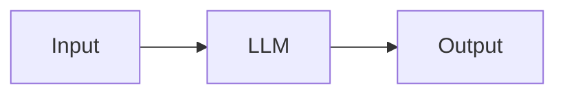
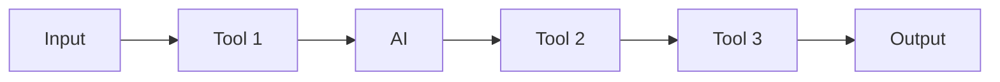
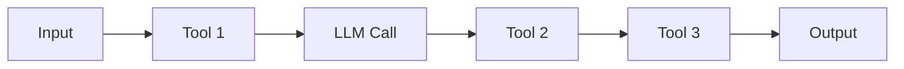
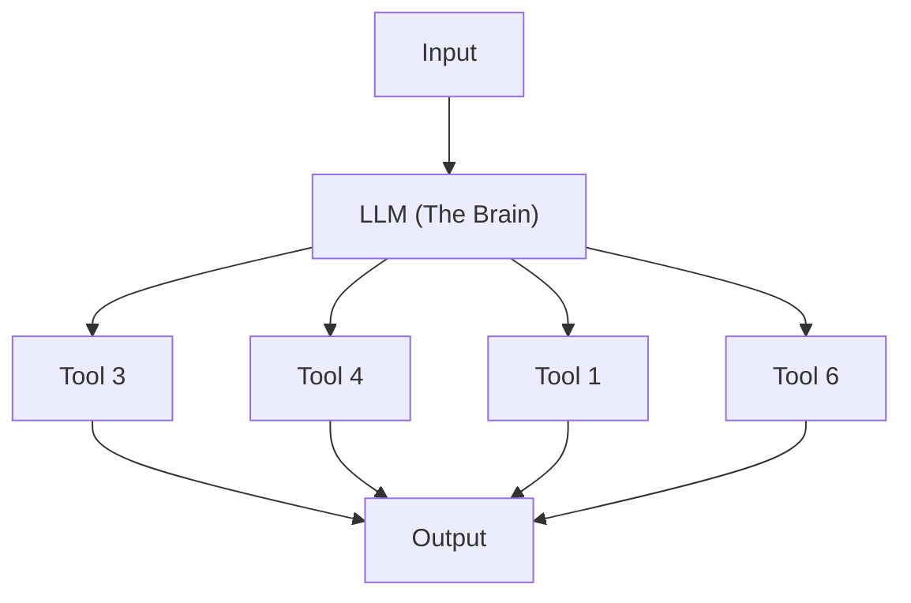

## Modern AI

- Evolution from simple, rule-based systems to advanced technologies
    - Modern systems are capable of understanding, reasoning, and interacting with humans in natural ways
    - Many modern AI applications are Large Language Models (LLMs)
- **[Key Milestone]** November 2022: The release of ChatGPT made the impact of modern AI highly evident

### Modern AI Evolution and Types

- The shift from traditional machine learning to modern AI is characterized by increased interactivity
    - Earlier iterations were primarily focused on machine learning tasks
    - Modern systems allow users to actually understand and interact with the technology's capabilities
- **[Core Capabilities]** Modern AI has moved beyond rule-based systems to technologies capable of:
    - Understanding
    - Reasoning
    - Interacting with humans in natural ways
- The course will introduce three key types of modern AI:

    1. Chatbots (e.g., ChatGPT)
    2. Instrumented AI workflows
    3. Autonomous AI agents

    - Each type possesses unique strengths, limitations, and real-world use cases

### The Role of Large Language Models (LLMs)

- LLMs serve as the core technology behind many modern AI applications
- They provide the underlying intelligence for:
    - Chatbots (e.g., ChatGPT)
    - Instrumented AI workflows
    - Autonomous AI agents
- **[Key Distinction]** While they share the same core engine, these three types differ significantly in their strengths, limitations, and real-world use cases

### Chat-based AI (e.g., ChatGPT)

- Operates as a standalone Large Language Model (LLM)
- **[Limitation]** It is not inherently powerful for complex automation because it cannot "do" anything on its own
    - It follows a simple linear process of responding to user prompts

### AI Workflows

- Represents the next layer of complexity beyond standalone chat
- **[Key Concept]** AI workflows involve integrating AI into existing multi-step processes
    - Traditional workflows consist of a sequence of tools (e.g., Tool 1 $\rightarrow$ Tool 2 $\rightarrow$ Tool 3)
    - An AI workflow adds an AI element into that sequence to enhance the process

### Characteristics of AI Workflows

- AI workflows are highly predictable and controllable
    - Data follows a single, fixed path through a sequence of tools and LLM calls
    - This linear structure ensures very consistent outputs

- **[Transitioning to Agents]** The limitation of a standard workflow is its lack of flexibility
    - In a workflow, there is no branching or decision-making
    - The next level of complexity occurs when we introduce "decision points" where the system can choose between different routes (e.g., Route 1, Route 2, or Route 3) based on the context.

### Autonomous AI Agents

- Represents the highest level of complexity in the evolution from chat to workflows
- **[Key Concept]** The LLM acts as the "brain" of the system
    - Instead of following a fixed path, the LLM understands the input and the desired output
    - It reasons through the problem to decide which specific tools to call and in what order to achieve the goal

- **[Comparison]** Unlike workflows, which are predictable and linear, agents are non-linear and decision-driven

### Key Terms to Know

- **AI (Artificial Intelligence)**: Technology that mimics human intelligence in tasks like reasoning, understanding, and decision making
- **LLM (Large Language Model)**: A type of AI trained on vast text datasets to generate human-like language
- **Generative AI**: A subset of AI that is capable of creating new content, such as text, images, or code

### Tool Calling via APIs

- Most tools used by AI agents are actually **APIs** (Application Programming Interfaces)
    - An API is a way for different software systems to communicate and share data
- **[Why use APIs?]** Instead of building a complex service from scratch (like an email server), an agent can simply call an existing service's API
    - Example: An agent can hit the **Gmail API** to send an email rather than trying to build its own email-sending capabilities

### Evolution of ChatGPT

- **The Foundation Years (2015-2019)**
    - 2015: OpenAI is founded
    - 2018: Research published on domain-specific generative models (trained on specific verticals)
    - 2018: GPT-1 launches
    - 2019: GPT-2 launches

#### Breakthrough & Mainstream Adoption (2020-2022)

- **Jun 11, 2020: GPT-3 launches**
    - Features 175 billion parameters
    - Represented a massive leap in performance
- **Nov 30, 2022: ChatGPT goes live**
    - Powered by GPT-3.5
    - Gained 1 million users in just five days

### Rapid Growth & Innovation (2023-2025)

- **Feb 1, 2023: ChatGPT Plus subscription launches**
- **Mar 14, 2023: ChatGPT hits 100M users**
- **Apr 25, 2023: Users gain control over data settings**
- **Jan 31, 2024: o1-mini released**
    - Introduced enhanced reasoning
- **Apr 10, 2024: o1-preview released**
    - Introduced agentic tool use, allowing the model to automatically use tools within ChatGPT

### Why This Matters

- The rise of ChatGPT and LLMs is about more than just having better chatbots
- It is fundamentally reshaping business operations:
    - How businesses automate tasks
    - How businesses think and approach problems
    - How businesses define and set up Standard Operating Procedures (SOPs)

### The Transformation of SOPs

- Traditional Standard Operating Procedures (SOPs) are being fundamentally altered
    - Instead of being static documents for human execution, they are becoming the training data for AI workflows
    - In some cases, the traditional SOP may cease to exist entirely because the AI workflow replaces the manual steps it once defined

### Importance of Understanding AI Evolution

- It is critical to understand the progression of AI technology
    - Skipping foundational concepts makes it difficult to effectively build advanced systems
- The evolution moves through distinct layers of complexity:
    - Chat-based AI (e.g., ChatGPT)
    - Structured AI workflows
    - Autonomous Agents