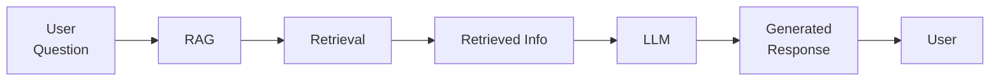
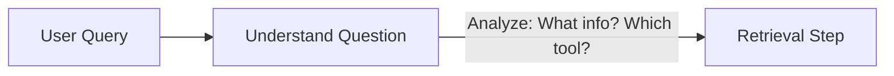
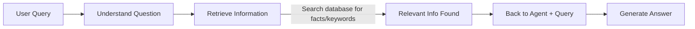
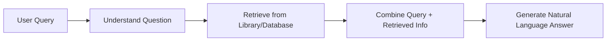

## Retrieval-Augmented Generation (RAG)

- Combines retrieval and generation
    - Retrieval: Searches for specific information in a database
    - Generation: Uses language skills to create a natural response
    - RAG = Context answers with accurate info on demand

### Why RAG is Useful

- Accesses up-to-date, specific information
- Examples:
        - Customer Support: Finds exact answers in FAQ
        - Healthcare: Pulls info from medical documents
        - Education: Retrieves details from textbooks and research

### How RAG Works

1. Understand the Question - Analyze what info is needed

- LLMs without retrieval are stuck with training data
    - If answer missing: Either says "can't find it" or **hallucinates** (makes up random, wrong info)
- RAG fixes this by giving flexible access to external knowledge
    - Pulls exact info on demand for accurate responses

2. Retrieve Relevant Information

    - Search database (e.g. vector DB) for matching context
- **Retrieval Part**: AI searches huge datasets (documents, company data, policies, contact info) to find specific information needed
    - Acts like a library lookup for the agent
- **Generation Part**: Takes the retrieved info and uses language skills to produce natural responses
    - Combines with retrieval for full RAG power

### RAG Generation Step

- **Generation part**: Acts like a storyteller using the AI model's language skills
    - Understands the question
    - Transforms retrieved info into natural sentences responding to the original query
- Combines retrieved facts with generation for accurate, natural responses

### RAG's Key Advantage Over Training Data Alone

- Training data limitations: Doesn't always include specific info or stay up-to-date
    - Without RAG, AI can't access fresh or precise details
- Vector databases solve this
    - Continuously updated for always-accurate info
    - Enables customized responses on demand
- Overall: RAG = customized response system pulling live, relevant facts

### AI Hallucination Problem

- Happens when AI lacks the answer in training data
    - Instead of admitting ignorance, it **guesses** or **predicts** what 'should be'
    - Fills gaps with info that 'sounds right' but is often wrong
- **Root cause**: AI bridges knowledge gaps by generating from patterns, not facts
    - From 'just guessing based on what it knows' without dedicated sources
- **RAG solution**: Retrieves accurate info on demand instead of hallucinating
- **Prompting role**: Key technique to minimize hallucinations in agents
    - (Details coming later)

### RAG Real-World Applications

- **Customer Support**: RAG pulls specific details from company's website, info, documents, FAQs, manuals
    - Helps answer customer questions directly
    - Looks up specific customer's profile for personalized, relevant info
- **Healthcare**: Retrieves latest info from medical documents
    - Critical for accurate, reliable responses where precision matters
- **Overall Value**: One of the most useful things to offer clients — enables on-demand access to exact, up-to-date data

### RAG in Education and Research

- Helps students, researchers, and teachers find answers directly from textbooks and papers
    - Acts as a great learning tool
    - Avoids hallucinations by pulling from reliable sources like treatments or medicine
- Personal note: Helpful when wrapping up college classes for accessing specialized knowledge
- Overall: System that lets agents tap into specialized knowledge on demand

---

### How RAG Works: Step 1 - Understand the Question

- First step: Analyze the incoming query to figure out what's being asked
    - Determines specific information needed
    - Identifies the right tool or source to access that info
- In n8n agent building: Agent thinks 'What do I need to do here? What am I looking for? Which tool?'
    - Sets up the retrieval by clarifying the goal before searching
- **Why this step?** Ensures targeted, relevant retrieval instead of blind searching

- Builds foundation for the full 3-step process (understand → retrieve → generate)

### How RAG Works: Step 2 - Retrieve Information

- **Second step**: After understanding the question, AI accesses the database
    - Searches huge set of data (relational or vector database)
    - Finds similar facts or keywords matching the query
    - Retrieves the specific information needed
- **Process flow**: Retrieved info goes back to the agent
    - Agent now combines original query + retrieved data
    - Forms natural language answer tailored to the question

- **Why this step?** Provides accurate, on-demand data from dedicated sources instead of relying on training patterns alone

### How RAG Works: Step 3 - Generate the Answer

- **Third step**: Agent combines original query + retrieved info to craft natural language response
    - Happens instantly after retrieval, feels like direct answer to user
    - Tailored specifically to the question asked
- **Full 3-step RAG flow recap**:

    1. Understand question (analyze needs)
    2. Retrieve from database/library
    3. Generate coherent response

### RAG in Action: Return Policy Example

- **Scenario**: Chatting with AI chatbot, ask "What's the return policy for this item?"
    - AI not trained on every item's policy → uses RAG
    - Checks policy documents, retrieves exact details
    - Delivers direct, accurate answer instantly
- **Key insight**: Enables handling specific, untrained details via on-demand retrieval
    - Process: Instant 3-steps make it seamless for real-time use

**Why complete this step?** Transforms raw retrieved data into user-friendly response using LLM language skills

### Why RAG is Important

- **Core benefits**: More accurate, reliable responses
    - Draws from up-to-date information instead of static training data
    - Tailored to specific tasks and user needs
- **Flexibility advantage**: No need to retrain model for every new knowledge piece
    - Use prompts to instruct: "This is what you need to do, how to access things, your role"
    - AI then uses that guidance to retrieve and respond effectively

**Example completion**: Return policy response - "You can return this specific item within 30 days for a full refund"

### RAG's Expanded Benefits

- **Faster responses**: Uses provided tools to access up-to-date, accurate information instantly
- **More trustworthy answers**: Pulls directly from data sources, avoiding hallucinations
- **High flexibility**: Handles tons of different questions, topics, and details without retraining models

**Core takeaway**: RAG = giving AI power to find information + generate answers

- Combines searching with reasoning (accounting) for smarter, more useful AI
- Makes AI more efficient, current, and practical

### RAG's Broad Applicability and Transition to Implementation

- **Universal relevance**: Powerful for AI agents in business, education, personal use
    - Essential skill for setting up agents
- **Not magic, just clever**: Like searching Google to answer questions
    - Combines searching + answering for next-level accuracy and knowledge
    - Expands AI capabilities significantly
- **Next step**: Vector databases (foundation for RAG retrieval)

### Transition to Vector Databases

- RAG retrieval uses vector databases (up next)
- Gets a little more complicated but still not too bad